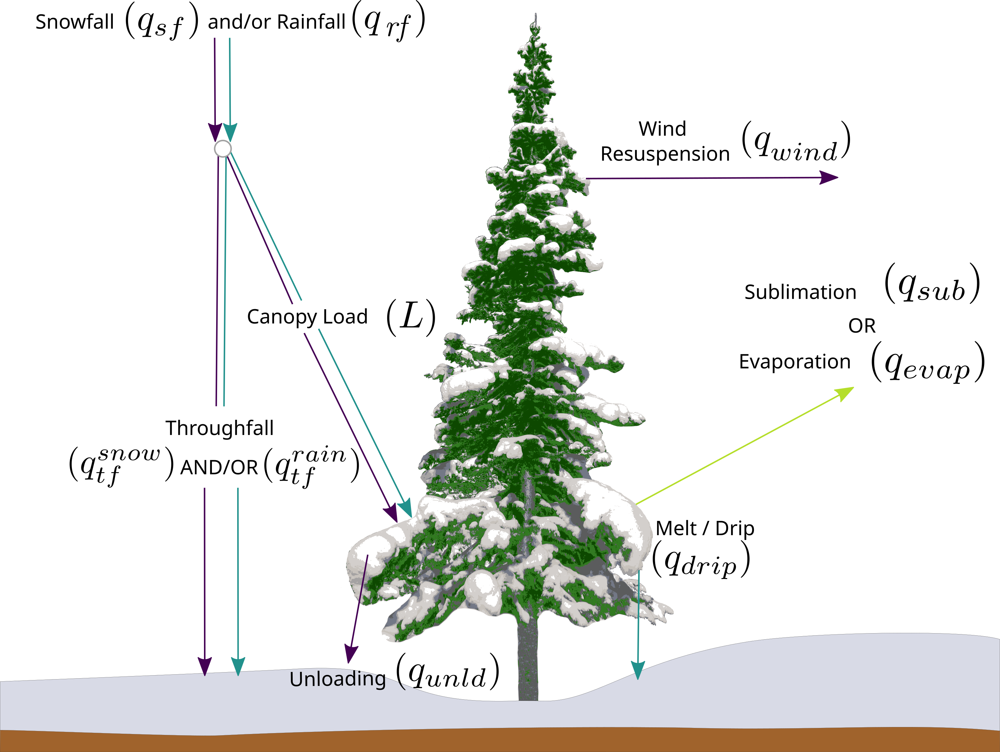
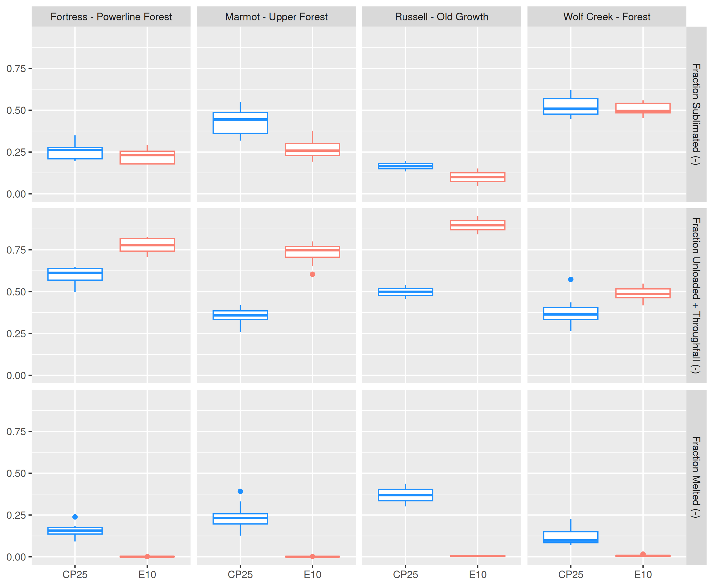

<!-- note this script wont run on its own because we have set all paths relative to the main index file one level up where it is run from  -->

```{r, include=FALSE}
knitr::opts_chunk$set(echo = FALSE, message=FALSE, warning=FALSE, fig.align='center')

setwd('/home/alex/local-usask/working-papers/model-eval-paper/')

source('scripts/get-manuscript-values.R')

```

## Evaluation of New Snow Interception and Canopy Snow Ablation Parameterisations for Partitioning Snowfall in Needleleaf Forests {#sec-chapter-5}

Manuscript status: Manuscript and analysis is complete and was submitted to the journal *Hydrological Processes* January 2026.

Citation: Cebulski, A. C., Pomeroy, J. W., Floyd, W. C. (in prep.). Evaluation of a New Needleleaf Forest Snowpack Model for Diagnosing Snow Accumulation Regimes in Western and Northern Canada. *Hydrological Processes*.

Role in thesis: This article incorporates the new parameterisations of snow interception and canopy snow ablation, developed in Chapters 2–4, into the Cold Regions Hydrological Model (CRHM) platform. The updated parameterisations are evaluated at four research basins in western and northern Canada. The results demonstrate improved simulations of subcanopy SWE, thereby addressing Research Question 4 of Objective 2 concerning the evaluation of the new parameterisations. The processes governing the partitioning of intercepted snow and subcanopy snow accumulation are diagnosed at each of the four sites addressing Research Question 5 of Objective 2.

Generative Artificial Intelligence (GenAI) Transparency Statement: GenAI tools (e.g., ChatGPT, Grammarly, Claude) were used sparingly and responsibly in this chapter to enhance text clarity and support code debugging.

A.C. Cebulski: Conceptualization (lead), analysis (lead), visualization (lead), writing – original draft (lead), writing review and editing (equal)\
J.W. Pomeroy: Conceptualization (supporting), funding acquisition (lead), analysis (supporting), project administration (lead), resources (lead), supervision (lead), writing review and editing (equal)\
W.C. Floyd: Conceptualization (supporting), analysis (supporting), writing review and editing (equal)

## Abstract

Snow interception by forest canopies occurs over 23% of the global land surface, influencing both subcanopy snow accumulation and land-surface energy exchanges. These processes are strongly influenced by both meteorological conditions and canopy density, resulting in differing process emergence in existing theories developed in distinctive climates, seasons, and forest types, and limited transferability to new environments. Recent studies have revealed new relationships to represent snow interception and canopy snow ablation processes applicable across a broader range of canopy structures and climatic conditions. To assess the effectiveness of these new parameterisations across differing climate and forests, both novel and traditional routines were implemented in the Cold Regions Hydrological Modelling platform and evaluated against observations of snow water equivalent within and beneath the canopy at four sites in western and northern Canada: two continental climate sites (Marmot Creek and Fortress Mountain, Alberta), one subarctic site (Wolf Creek, Yukon Territory), and one temperate-maritime site (Russell Creek, British Columbia). The observed fraction of seasonal snowfall stored in the subcanopy snowpack at peak SWE varied from 0.3 at Russell Creek, 0.4 at Marmot and Wolf Creek, and 0.6 at Fortress Mountain. Uncalibrated simulation of canopy intercepted snow duration at Marmot Creek improved with the new model, where the fractional differences from observations decreased from `r cpy_load_frac_yr$percent_change_e10_obs |> round(1)`% to `r cpy_load_frac_yr$percent_change_cp25_obs |> round(1)`%. The new model demonstrated improved simulation of subcanopy snow accumulation at a temperate-maritime site, and had marginally improved performance at cold-continental and subarctic sites. Despite the relatively small improved accuracy at the cold climate sites, the new model is based on improved physical understanding leading to increased confidence in process diagnosis. At cold, low-wind sites, about half of annual snowfall was lost via sublimation of intercepted snow, whereas greater unloading at a cold, wind-exposed site reduced sublimation losses. At the high-snowfall temperate-maritime site, canopy snowmelt, meltwater drip, and melt-induced unloading dominated, delivering the largest fraction of snowfall to the forest floor despite high initial interception efficiency. 

## Introduction

Snow is an important water resource, directly supporting over two billion people globally [@Immerzeel2020; @Viviroli2020], while also affecting the Earth's energy balance via surface albedo [@Thackeray2014; @Wang2016], surface temperature [@Pomeroy2016a], soil temperature [@Zhang2018], and stream temperatures [@Leach2014]. However, snowpacks are increasingly affected by changes in both climate and vegetation cover worldwide [@Lopez-Moreno2014; @Immerzeel2020; @Viviroli2020]. Hydrological models are essential tools for understanding how climate and vegetation influence snow processes and downstream water resources, and their accuracy depends on accurate representations of physical processes. Snow falls in forested areas over half of the Northern Hemisphere [@Kim2017] and over 23% of land mass globally [@Deschamps-Berger2025], spanning diverse climates and forest structures, highlighting the need for robust, transferable models. In cold-dry climates, sublimation of snow intercepted by forest canopies can return up to 45% of seasonal snowfall back to the atmosphere [@Essery2003; @Sanmiguel-Vallelado2017], whereas in temperate-maritime climates, sublimation is less prevalent and a large fraction of snowfall melts in the canopy [@Storck2002]. Yet, uncertainties in forest-snow process representation lead to variable transferability across climates and forest types when simulating subcanopy snow water equivalent (SWE) [@Essery2003; @Gelfan2004; @Rutter2009; @Krinner2018] and diagnosing snow processes [@Lundquist2021; @Lumbrazo2022]. The strong dependence of snowfall partitioning on meteorology and canopy density compounds this variability [@Storck2002; @Pomeroy1998b; @Staines2023; @Mazzotti2021; @Rojas-Heredia2024], challenging earlier canopy snow parameterisations developed from limited observations and exhibited distinct process emergence across differing environmental conditions [@Lundquist2021]. While simulating SWE in forests remains challenging, it is a crucial aspect to understanding the impacts of climate and land cover changes on water resources in many forested cold regions across the globe.

Recent studies have advanced understanding of the canopy snow energy and mass balance across a broader range in meteorological conditions and canopy structures (see @sec-chapter-3 and @sec-chapter-4; Lumbrazo et al., 2022; Lundquist et al., 2021; Mazzotti et al., 2021), with potential to improve SWE simulations in more diverse forested basins. For example, earlier parameterisations that calculate throughfall as a function of snow load may have been based on measurements that also included unloading [@sec-chapter-2]; and when combined with separate calculations of unloading as a function of snow load, this can overestimate the amount of snowfall reaching the ground (@sec-chapter-3; @sec-chapter-4; Lundquist et al., 2021). @Staines2023 and @Cebulski2025a showed that initial interception can be predicted as a function of canopy density without assuming a maximum canopy snow load. Moreover, @Roesch2001 and @Lumbrazo2022 showed the importance of representing both wind and melt-induced unloading for representing canopy snow ablation. A new physically based canopy snow mass and energy balance model developed by @sec-chapter-4 improved representation of canopy snow ablation compared to earlier approaches that either omitted key processes such as dry snow unloading [@Andreadis2009] or relied on empirical relationships such as ice-bulb temperature indexed melt-driven unloading and drip [@Ellis2010]. These advances have been implemented as new parameterisations in the modular Cold Regions Hydrological Modelling Platform [@Pomeroy2022] to answer the following research questions:

1. What is the fraction of seasonal snowfall stored in the subcanopy snowpack in mature needleleaf forests across continental, subarctic, and temperature-maritime climates?
2. How accurately does a novel hydrological model simulate canopy snow load and subcanopy SWE across varying forest types and climates compared to an existing model?
3. How is snowfall in needleleaf forests partitioned into throughfall, interception, sublimation, unloading, and melt/drip in differing climates and canopy structures? 

Evaluation of the new model in simulating initial snow interception has been addressed in @sec-chapter-3 and ablation of intercepted snow in @sec-chapter-4.

## Methods

### Study Sites

This study was conducted at four locations in western and northern Canada spanning a range of climate and forest types (@fig-map; @tbl-site-meta). The simulation years for each site are shown in @tbl-site-meta and were selected based on the availability of subcanopy SWE measurements and hourly station-based observations of air temperature, relative humidity, wind speed, total precipitation, and incoming shortwave radiation. The sensor heights for the meteorological observations at each station are shown in @tbl-sensor-heights. Precipitation and incoming shortwave radiation were measured in open clearings while the air temperature and speed measurement locations differed and are described below for each site. Precipitation was corrected for undercatch following phase correction by @Harder2013 using the catch efficiency equation of @Smith2007. At each site, snow surveys consisted of snow depth measurements at all locations and snow density measurements at one out of every five locations. SWE was calculated from snow depth and snow density following the methods outlined in @Pomeroy1995. The four study sites include:

Wolf Creek Research Basin - Forest Site (60.60°N, 134.96°W, 750 m asl.) is located 16 km south of Whitehorse, Yukon Territory [see basin scale location in Fig. 1 in @Rasouli2019] in a level dense forest (@tbl-site-meta) with a sub-arctic climate (@fig-met-normals). Air temperature, relative humidity, and wind speed were measured on a tower installed within the canopy, ~200 m from the snow survey transect (@tbl-sensor-heights). Precipitation was measured at the Whitehorse Airport (60.73°N, 135.1°W, 707 m), 14 km south from the Forest Site and was not adjusted due to the similar elevation and proximal location. Incoming shortwave radiation observations were not available for Wolf Creek and were simulated following theoretical clear-sky radiation by @Garnier1970 and atmospheric transmittance by @Shook2011 using an adaptation of the method developed by @Annandale2002 which uses daily minimum and maximum air temperatures and a location correction factor of 0.16 for an interior climate. Snow surveys were conducted along a transect that traverses through mature forest consisting of primarily white spruce (*Picea glauca*) and interior Lodgepole pine (*Pinus contorta*). Additional details on the snow survey and meteorological measurements is described in @Rasouli2019. 
  
Russell Creek Experimental Watershed - Upper Stephanie Old Growth Site (50.32°N, 126.35°W, 700 m asl.) is located on northern Vancouver Island, British Columbia (@fig-map) in a temperate-maritime climate that receives substantial precipitation (1960 mm yr^-1^ on average, @fig-met-normals). Air temperature, relative humidity, and wind speed were measured on a tower installed within the canopy in the centre of the snow survey transect (@tbl-sensor-heights). Snow survey transects were conducted in cardinal directions within a mature old growth forest that consists of Amabilis fir (*Abies amabilis*) and western hemlock (*Tsuga heterophylla*) (@tbl-site-meta; Floyd, 2012). Additional details on the snow survey and meteorological instrumentation are provided in @Floyd2012. Precipitation data were unavailable at the Russell site for the 2008 water year. For this period, precipitation from the Tsitika Summit station (50.28°N, 126.36°W, 450 m asl.) operated by the British Columbia Ministry of Transport and located 5 km from the Old Growth site, were used instead without adjustment.
  
Fortress Mountain Research Basin - Powerline site (50.83°N, 115.20°W, 2100 m asl., Kananaskis, Alberta) is located on a wind-exposed subalpine ridge top covered with sparse forest (@tbl-site-meta) with a continental climate (@fig-map, @fig-met-normals). The vegetation at this site consists of coexisting mature subalpine fir (*Abies lasiocarpa*) and Engelmann spruce (*Picea engelmannii*) tree species [@Langs2020]. Air temperature, relative humidity, and wind speed were measured on a tower located in a 10 m diameter clearing, 10–40 m from the snow survey transect (@tbl-sensor-heights). Snow survey measurements of snow depth and density were collected following a transect through mature forest east of the Powerline meteorological tower (see @fig-site-map in @sec-chapter-3). The meteorological forcing data used in this study is described in detail in @sec-chapter-4.

Marmot Creek Research Basin - Upper Forest site (50.93°N, 115.16°W, 1848 m asl., Kananaskis, Alberta) is located on a dense forested plateau with a continental climate 14 km north of Fortress [see basin scale location in Fig. 1 in @Fang2019] but receives 680 mm yr^-1^ of precipitation on average, compared to 1045 mm yr^-1^ at Fortress (~50% higher than Marmot, @fig-met-normals). The forest consists primarily of Engelmann spruce (*Picea engelmannii*), subalpine fir (*Abies lasiocarpa*), and Lodgepole pine (*Pinus contorta*) species (@tbl-site-meta; Fang et al., 2019; Staines & Pomeroy, 2023). Air temperature, relative humidity, and wind speed were measured on a tower located in a 50 m diameter clearing, 25–50 m away from the snow survey transect (@tbl-sensor-heights). Snow surveys were conducted following a cardinal transect through mature forest surrounding the "Upper Clearing" meteorological tower [see Fig. 1b in @Staines2023]. The meteorological forcing data and corresponding instrumentation used from this site are described in @Fang2019. Canopy snow load observations were collected within the Upper Forest site to validate simulations. A weighed subcanopy snow bucket installed by @MacDonald2010 provided throughfall measurements, which were used with a mass balance calculation (@eq-dwdt-ode in @sec-chapter-2) to estimate canopy snow load for 11 snowfall events between February 2007 and February 2008. A weighed tree lysimeter installed by @Staines2022 on the Upper Forest meteorological tower provided measurements of snow load between December 2018 and June 2019. The weighed tree was scaled from weight of intercepted snow in the tree to mass of intercepted snow per unit area using snow survey measurements from the two snowfall events reported in @Staines2023 following the methodology outlined in @Pomeroy1993a and @Hedstrom1998.

::: {.landscape}
```{r, echo=FALSE}
#| label: tbl-site-meta
#| tbl-cap: "Simulation period (Years), location, and vegetation characteristics, including canopy cover ($C_c$), leaf area index (LAI), and mean tree height ($\\overline{D_{can}}$), for the four study sites."
#| tbl-colwidths: [12, 6, 14, 14, 16, 6, 7, 8, 20]

site_meta |>
  mutate(
    across(where(is.numeric), round, 2),
    Longitude = abs(Longitude)
    ) |> 
  # select(
  #   Model = name,
  #   Station = station,
  #   MB = `Mean Bias`,
  #   # MAE,
  #   RMSE = `RMS Error`
  # ) |>
  knitr::kable(
    col.names = c(
    "Site Name",
    "Years",
    "Elevation (m)",
    "Latitude (°N)",
    "Longitude (°W)",
    "$C_c$ (-)",
    "LAI (-)",
    "$\\overline{D_{can}}$ (m)",
    "Dominant Species"
  ),
  escape = FALSE
  )

```
:::

```{r, echo=FALSE}
#| label: tbl-sensor-heights
#| tbl-cap: "Sensor heights in metres of air temperature, relative humidity, wind speed, precipitation, and incoming solar radiation data for each station."
#| tbl-colwidths: [13, 27, 20, 22, 20]

sensor_heights |>
  mutate(
    across(where(is.numeric), round, 2)
    ) |> 
  # select(
  #   Model = name,
  #   Station = station,
  #   MB = `Mean Bias`,
  #   # MAE,
  #   RMSE = `RMS Error`
  # ) |>
  knitr::kable(
    col.names = c(
    "Site Name",
    "Air Temp. and Relative Humidity (m)",
    "Wind Speed (m)",
    "Precipitation (m)",
    "Incoming Solar Radiation (m)"
  ),
  escape = FALSE
  )

```

{#fig-map width=80%}

{#fig-met-normals}

### Simulation of Subcanopy Snowpack

The Cold Regions Hydrological Modelling Platform (CRHM) was implemented to simulate SWE stored in the canopy and in the subcanopy snowpack, and diagnose processes that partition intercepted snow at each of the four forest plots. The CRHM platform is described in detail by @Pomeroy2022. The up-to-date source code is available at https://github.com/srlabUsask/crhmcode, and the version used in this manuscript is archived at @CRHM2025. Hourly climate forcing data from station-based measurements of air temperature, relative humidity, wind speed, total precipitation, and above canopy incoming shortwave radiation were used to run the CRHM models.

The canopy snow mass and energy balance was treated using two different approaches. An updated approach following new relationships presented in @sec-chapter-3 and @sec-chapter-4 hereafter called "CP25" to represent the canopy snow energy and mass balance. See @sec-cp25-desc for a description of the state equations and corresponding flux parameterisations and @sec-appdx-ch5 for a description of the modules and links to the CRHM source code relevant for the new CP25 model. The new approach simulates initial interception of snow in the canopy as a function of canopy density and hydrometeor trajectory angle (@sec-chapter-3) and subsequent ablation of snow intercepted in the canopy from unloading (removal of solid snow clumps from the canopy) by melt and cold/dry-snow processes (@sec-chapter-4), energy balance-based snowmelt and drip (@sec-chapter-4), and energy balance-based sublimation [@Essery2003]. A second approach hereafter called "E10" which is based on observations by @Hedstrom1998, @Pomeroy1998b, and @Floyd2012; and implemented as described in @Ellis2010. E10 calculates initial interception of snow in the canopy as a function of canopy density, antecedent snow load, and a species dependent storage capacity following @Hedstrom1998. Ablation of snow intercepted in the canopy is determined by dry snow unloading [function of canopy snow load as in @Hedstrom1998], unloading due to melt [@Ellis2010], canopy snowmelt drainage [threshold function of ice-bulb temperature as in @Ellis2010], and sublimation by an analytical energy balance-based parameterisation [@Pomeroy1998b]. See @sec-chapter-2 for a complete description of the E10 parameterisation. The E10 model was implemented as the baseline model in this study as it has shown strong performance at sites across Canada, Russia, Switzerland, and Spain [@Gelfan2004; @Ellis2010; @Sanmiguel-Vallelado2022; @Pomeroy2022], it includes a representation for both melt- and cold/dry-driven unloading of intercepted snow, in contrast to @Andreadis2009, and it separates the solid snow unloading and drip processes, which are not separated in @Roesch2001. While neither the E10 nor CP25 model was calibrated for this study, their parameterisations were originally developed using data from Marmot (E10) and sites in Prince Albert National Park (PANP), northern Saskatchewan (E10) and Fortress (CP25). The PANP sites are characterised by a cool, subhumid continental climate, with older jack pine (Pinus banksiana) stand and a younger black spruce (Picea mariana) stand [@Hedstrom1998].

A two-layer energy and mass balance snowmelt model [Snobal, @Marks1998] was used to calculate subcanopy snowpack evolution. Net shortwave radiation to the subcanopy snowpack was simulated by calculating the transmittance of irradiance through the canopy, less the amount reflected from the snow surface [@Pomeroy2008; @Ellis2010]. Incoming longwave radiation to subcanopy snow was simulated by thermal emissions from the atmosphere and vegetation elements [@Ellis2010; @Pomeroy2009]. Sensible and latent heat fluxes to the subcanopy snowpack were determined using an approach adopted from @Brutsaert1982 and @Marks1992 and is described in the CRHM source code. Only two water years were simulated at Russell due to limited model forcing and validation data.

### Description of New Snow Interception Model {#sec-cp25-desc}

The following section describes the state equations for simulating snow and liquid water intercepted in the canopy (@eq-canopy-mass-bal-05) and the energy balance of the canopy control volume (@eq-eb-05). The flux parameterisations included in each of the state equations are also described. Forcing variables to run the model include: air temperature, relative humidity, wind speed, precipitation, and incoming shortwave radiation. Required site attributes include: latitude, longitude, elevation, slope, aspect, canopy coverage (commonly available across the globe), leaf area index, canopy height, surface roughness, and displacement height. Default parameter values are listed below and are also available in the data repository corresponding to this manuscript (https://doi.org/10.5281/zenodo.17409551) under the file path `crhm/prj`.   

#### Mass Balance for Intercepted Snow

The following mass balance was implemented to track the state of canopy load ($L$, kg m^-2^) over time:

$$
\frac{dL}{dt} = 
[q_{sf} - q_{tf}^{snow}] + [q_{rf} - q_{tf}^{rain}] - q_{unld} - q_{drip} - q_{sub} - q_{evap}
$$ {#eq-canopy-mass-bal-05}

where $L$ is comprised of snow ($L^{snow}$, kg m^-2^) and liquid water ($L^{liq}$, kg m^-2^) intercepted in the canopy (i.e., $L = L^{snow} + L^{liq}$), $q_{sf}$ is the snowfall rate (kg m^-2^ s^-1^), $q_{tf}$ is the throughfall rate of snowfall ($q_{tf}^{snow}$, kg m^-2^ s^-1^), $q_{rf}$ is the rainfall rate (kg m^-2^ s^-1^), $q_{tf}^{snow}$ is the throughfall rate of rainfall (kg m^-2^ s^-1^), $q_{unld}$ is the unloading rate of intercepted snow (kg m^-2^ s^-1^), $q_{drip}$ is the canopy snow drip rate (kg m^-2^ s^-1^) resulting from intercepted rainfall or intercepted meltwater exceeding the liquid water storage capacity of the canopy ($L_{max}^{liq}$, kg m^-2^), $q_{sub}$ is the intercepted snow sublimation rate (kg m^-2^ s^-1^), and $q_{evap}$ is the evaporation rate of liquid water intercepted in the canopy (kg m^-2^ s^-1^).

{#fig-mbal}


##### Precipitation Phase 

The phase of atmospheric precipitation was determined from the energy balance of falling hydrometeors. The fraction of precipitation as rainfall, $f_r$ was estimated following @Harder2013 as:

$$
f_r(T_i) = \frac{1}{1+b \cdot c^{T_i}}
$$

where $T_i$ is the hydrometeor temperature (K) and fitting coefficents $b$ and $c$ are provided in @Harder2013. $T_i$ was estimated following @Harder2013 as: 

$$
T_i = T_a + \frac{D}{\lambda_T}\lambda_{\text{vap/sub}}\left(\rho_{act} - \rho_{\text{sat}(T_i)}\right)
$$

where $T_a$ is the air temperature (K), $D$ is the diffusivity of water vapour in air (m^-2^ s^-1^), $\lambda_T$ is the thermal conductivity of air (J m^-1^ s^-1^ K^-1^), $\lambda_\text{vap/sub}$ is the latent heat of either vaporisation or sublimation (J kg^-1^), $\rho_{act}$ is the water vapour density of the free atmosphere (kg m^-3^), $\rho_{\text{sat}(T_i)}$ is the saturated water vapour density at $T_i$ (kg m^-3^). This approach requires an interative solution, assumes thermodynamic equilibrium, and assumes negligible net radiant energy to the hydrometeors but is more robust than approaches that use air temperature or dew point temperature [@Harder2013].

##### Throughfall

The throughfall rate of snowfall ($q_{tf}^{snow}$) was determined as a function of the snow-leaf contact area ($C_p$, dimensionless) as in @Cebulski2025a as:

$$
q_{tf}^{snow} = q_{sf} \cdot [1 - (C_p \alpha)]
$${#eq-tf-snow}

where $\alpha$ is an interception efficiency coefficent determining the fraction of snowfall that contacts the canopy [taken as 1 based on observations from a snowfall event with air temperatures ranging from -2.5 to 0°C in @Cebulski2025a]. $C_p$ was estimated as:

$$
C_p = C_c + [(1-C_c) \cdot (b \cdot \text{sin}(\theta_h)^2)]
$${#eq-cp-05}

where $C_c$ is canopy coverage (dimensionless), $b$ is a fitting coefficeint [estimated to be 0.91 from observations in @Cebulski2025a], and $\theta_h$ is the hydrometeor trajectory angle from a vertical plane (radians). $\theta_h$ was determined as:

$$
\theta_h = \arctan \left(\frac{x_h(u_z)}{v_h(D_h)}\right)
$${#eq-ta-05}

where $v_h(D_h)$ denotes the terminal fall velocity of the hydrometeor (m s^-1^), expressed as a function of hydrometeor diameter, $D_h$, and $x_h(u_z)$ represents the horizontal hydrometeor velocity (m s^-1^), parameterised as a function of within-canopy wind speed, $u_z$, at height $z$ above the ground. In the absence of direct observations of hydrometeor motion, $v_h(D_h)$ can be approximated using published values, such as 0.8 m s^-1^ reported by @Isyumov1971 and 0.9 m s^-1^ in @Cebulski2025a, while $x_h(u_z)$ may be represented by the horizontal wind speed. This formulation assumes that hydrometeors are following fluid points in the atmosphere.

The throughfall rate of rainfall ($q_{tf}^{rain}$) was determined as a function of canopy coverage ($C_c$) following many rainfall interception studies [e.g., @Valante1997] and modelling applications [e.g., @Pomeroy2022]:

$$
q_{tf}^{rain} = q_{rf} \cdot (1-C_c)
$${#eq-tf-rain}

##### Unloading of Intercepted Snow

Unloading of intercepted snow ($q_{unld}$) due to melt and/or from shear stress on snow, wind erosion, branch movement, structural degradation, bond weakening and increased elasticity of branches and other non-melt related processes was estimated following @Cebulski2026 as:

$$
q_{unld} = (q_{melt}^{veg} \cdot R) + (L \cdot \tau_{mid} \cdot b)
$$ {#eq-unld-05}

where $q_{melt}^{veg}$ is the energy balance-based melt rate of intercepted snow (kg m^-2^ s^-1^) calculated in @eq-canopy-snowmelt-05, $R$ is the ratio of unloading-to-melt (dimensionless) calculated from @eq-fm-05, $\tau_{mid}$ is the wind shear stress ($N m^{-2}$), and $b$ is a fitting coefficient (taken as 0.37 from observations in @Cebulski2026). $R$ was estimated using the linear function:

$$
R = m \cdot L + w
$$ {#eq-fm-05}

where $m$ and $w$ are fitting coefficients determined as 0.15 and -0.43 based on observations in @Cebulski2026. The wind driven unloading component may include entrainment of snow into the above canopy airspace during high wind speeds; however, this model does not directly incorporate sublimation of snow associated with this removal and unloads it directly to the ground.

$\tau_{mid}$ can be estimated using two approaches. The first approach, used in this study, estimates shear stress directly from within-canopy wind speed ($u_{mid}$, m s$^{-1}$):

$$
\tau_{mid} = u_{mid}^2 \cdot \beta
$${#eq-tau-wind}

where $\beta$ is a fitting coefficient determined as `r wind_mid_to_tau_mid` (R^2^ = 0.6) from observations in @Cebulski2026. Because $u_{mid}$ is measured within the canopy boundary layer, the Prandtl-von Kármán logarithmic wind profile does not apply. 

Since above-canopy wind speed ($u_{top}$) is more commonly available as a forcing variable, a second approach using the Prandtl-von Kármán theory is provided to estimate $\tau_{mid}$ from $u_{top}$. First, the friction velocity above the canopy is calculated as:

$$
u^*_{top}  = \frac{u_{top}\kappa}{ln(\frac{z - d_0}{z_0})}
$${#eq-ustar-wind}

where $u^*_{top}$ is the friction friction velocity above the canopy (m s^-1^), $\kappa$ is the von Kármán constant, $z$ is the instrument height (m), $d_0$ is the displacement height (m), and $z_0$ is the roughness length of momentum (m). Then the wind shear stress above the canopy ($\tau_{top}$, N m^-2^) can be approximated as:

$$
\tau_{top} = u^{*2}_{top} \cdot \rho_{act}
$${#eq-tau-ustar}

Given the uncertainties in estimating within canopy wind flow, a simple linear transfer function was used to determine $\tau_{mid}$ as:

$$
\tau_{mid} = \tau_{top} \cdot \delta  
$${#eq-tau-tau}

where $\delta$ was determined as `r tau_top_to_bot` (R^2^ = 0.3) based on observed shear stress above and below the canopy at Fortress Mountain as described in @Cebulski2026. 

##### Drip of Liquid Water

The rate of drip ($q_{drip}$) from canopy snowmelt water and/or rain intercepted on the canopy was determined as:

$$
q_{drip} = \begin{cases}
    L^{liq} - L_{max}^{liq}, & \text{if } L^{liq}> L_{max}^{liq},\\
    0 ,              & \text{otherwise.}
\end{cases}
$${#eq-drip-05}

where $L_{max}^{liq}$ is the liquid water storage capacity of the canopy (kg m^-2^) and calculated as:

$$
L_{max}^{liq} = Lh + cLAI
$${#eq-liq-hold-cap-05}

where $h$ is the liquid meltwater holding capacity that the canopy can retain against gravity (-) and $n$ is a storage constant of the vegetation elements (-). @Andreadis2009 estimated $h$ as 0.035 and $c$ as $e^{-4}$ while using a two sided plant (leaf) area index (LAI). In this study, $h$ was set to 0.01, and $c$ was defined as $C_c \cdot 0.2$ and a one-sided effective LAI was used, including the clumping factor to account for needleleaf canopy structures, following the approach of @Ellis2010 for rainfall interception.

##### Sublimation and Evaporation of Intercepted Snow and Water

The sublimation rate ($q_{sub}$) of intercepted snow was calculated as:

$$
q_{sub} = \frac{Q_l}{\lambda_{sub}}
$${#eq-sub-05}

where $Q_l$ is the turbulent flux of latent heat (W m^-2^) calculated in @eq-ql-05 and $\lambda_{sub}$ is the latent heat of sublimation (J kg^-1^). 

The evaporation rate ($q_{evap}$) of intercepted rain was calculated when snow was not intercepted in the canopy as:

$$
q_{evap} = \frac{Q_l}{\lambda_{vap}}
$${#eq-evap-05}

where $\lambda_{vap}$ is the latent heat of vaporisation (J kg^-1^).

#### Energy Balance for Intercepted Snow

The energy balance approach to calculate the energy available for melting snow or freezing liquid water intercepted in the canopy ($Q_{melt}$, W m^-2^) and to track the canopy snow temperature over time ($\frac{\Delta T_{vs}}{\Delta t}$, K s^-1^) is expressed as:

$$
Q_{melt} = 
Q_{sw} +
Q_{lw} +
Q_{p} + Q_{h} + Q_{l} - [C_p^{ice} L \frac{\Delta T_{vs}}{\Delta t}]
$$ {#eq-eb-05}

where $Q_{sw}$ and $Q_{lw}$ are the net shortwave and longwave radiation heat fluxes to the canopy snow (W m^-2^), $Q_p$ is the advective energy rate (W m^-2^), and $Q_{l}$ and $Q_{h}$ are the turbulent fluxes of latent heat and sensible heat respectively (W m^-2^, positive towards canopy snow), and $C_p^{ice}$ is the specific heat capacity of ice (J kg^-1^ K^-1^).

The rate of snow in the canopy undergoing phase change, $q_{melt}^{veg}$ (kg m^-2^ s^-1^), may be calculated as:

$$
q_{melt}^{veg} = \frac{Q_{melt}^{veg}}{\lambda_{fus} B}
$$ {#eq-canopy-snowmelt-05}

where $\lambda_{fus}$ (J kg^-1^) is the latent heat of fusion, $B$ is the fraction of ice in a unit mass of wet snow usually taken as 0.95-0.97 in surface snowpack modelling [@Gray1988].

![Conceptual representation of the physical processes important in the energy balance of snow intercepted in the canopy. The dashed lines represent energy extinguished, reflected or re-emitted by the canopy, intercepted snow or surface snowpack and sent outside of the canopy control volume. The superscripts denote the following control volumes: the canopy (veg), snow intercepted in the canopy (vs), the atmoshpere (atm), the snow-atmosphere interface (sai), and the top of the canopy between the upper atmosphere and canopy airspace (total). All other symbols are defined in the text.](figs/supplement/IMG_4319_bitmap_5_control_volume_energy_airspace.png){#fig-ebal}

##### Net Shortwave Radiation

$Q_{sw}$ was determined as:

$$
Q_{sw} = Q_{sw}^{in} \cdot (1 - \alpha_s) \cdot \tau_{50}^{veg}
$$ {#eq-sw-05}

where $Q_{sw}^{in}$ is the downwelling shortwave radiation (W m^-2^), $\alpha_s$ is the albedo of snow intercepted in the canopy (-), and $\tau_{50}^{veg}$ is the canopy transmittance to $Q_{sw}^{in}$ (-). The transmittance term $\tau_{50}^{veg}$ was calculated using Equation 10 from @Pomeroy2009, with half of the leaf area index (LAI) used in the formulation. This assumption is supported by studies such as @Weiskittel2009 and @Kesselring2024, which indicate that approximately 50% of total leaf area is concentrated within the upper half of coniferous canopies. The resulting $Q_{sw}$ represents an approximation of the net shortwave radiation incident on snow intercepted in the canopy and simplifies the alternative approach of solving a partial differential equation to resolve radiation at multiple canopy height layers. Upwelling shortwave radiation reflected from the surface snowpack is assumed to contribute negligibly to intercepted canopy snow because it is largely obstructed by vegetation elements located beneath the intercepted snow [@Pomeroy2009].

##### Net Longwave Radiation

$Q_{lw}$ was approximated as:

$$
Q_{lw} = \downarrow Q_{lw}^{atm} + \uparrow Q_{lw}^{veg, out} - Q_{lw}^{vs, out}
$$ {#eq-lw-05}

where $Q_{lw}^{atm}$ is the downwelling longwave radiation from the atmosphere (W m^-2^), $Q_{lw}^{veg,out}$ is the upwelling longwave radiation emitted by vegetation elements underlying the snow intercepted in the canopy (W m^-2^), and $Q_{lw}^{vs,out}$ is the outgoing longwave radiation from the upper and lower surfaces of the intercepted canopy snow layer (W m^-2^), calculated as:

$$
Q_{lw}^{vs, out} = 2 \epsilon_{s} \sigma T_{vs}^4
$$ {#eq-lw-vs-05}

where $\epsilon_s$ is the emissivity of snow (-), taken as 0.99, and $\sigma$ is the Stefan-Boltzmann constant (5.67 × 10^-8^ W m^-2^ K^-4^). In this study, $Q_{lw}^{atm}$ was approximated following @Sicart2006 to represent the influence of atmospheric moisture and cloud cover on atmospheric emissivity. The term $Q_{lw}^{veg,out}$ was calculated assuming that vegetation elements are in thermal equilibrium with the air temperature, with an additional temperature increase resulting from the extinction of $Q_{sw}^{in}$ within the canopy [@Pomeroy2009, Eq. 4].

##### Advected Energy from Precipitation

$Q_p$ was calculated as:

$$
Q_p = [C_p^{liq} m_r(T_r - T_{vs}) + C_p^{ice} m_s(T_s - T_{vs})] / \Delta t
$$ {#eq-qp-05}

where $C_p^{liq}$ is the specific heat capacity of liquid water (J kg^-1^ K^-1^), $m_r$ and $m_s$ are the specific masses of rainfall and snowfall (kg m^-2^), respectively, and $T_r$ and $T_s$ are the corresponding temperatures of rainfall and snowfall (K).

##### Sensible Heat Exchange

$Q_h$ was calculated as:

$$
Q_h = \frac{\rho_{act}}{r_a} C_p^{air} (T_a - T_{vs})
$$ {#eq-qh-05}

where $\rho_{act}$ is the air density (kg m^-3^), $C_p^{air}$ is the specific heat capacity of air (J kg^-1^ K^-1^), $T_a$ is the air temperature (K), and $r_a$ is the aerodynamic resistance (s m^-1^), which was approximated using Equation 4 from @Allan1998 as:

$$
r_a = \frac{\text{log}(\frac{z_T - d_0}{z_0})\text{log}(\frac{z_u - d_0}{z_0})}{\kappa^2 u_z}
$$ {#eq-ra-05}

where $z_T$ is the temperature measurement height (m), $d_0$ is the displacement height (m), approximated as 2/3^rd^ of the mean canopy height, $z_0$ is the roughness length (m), approximated as 1/10^th^ of the mean canopy height, $z_u$ is the wind speed measurement height (m), $\kappa$ is von Kármán's constant (0.41), and $u_z$ is the wind speed measured at height $z_u$ (m s^-1^).

##### Latent Heat Exchange

$Q_l$ was calculated as:

$$
Q_l = \frac{\rho_{act}}{r_i+r_a} (q_a(T_a) - q_{vs}(T_{vs}))
$$ {#eq-ql-05}

where $r_i$ is the resistance for moisture transport from intercepted snow to the canopy air space [Eq. 28 in @Essery2003], and $q_a(T_a)$ and $q_{vs}(T_{vs})$ are the specific humidity (-) at the air temperature and canopy snow temperature, respectively. The resistance $r_i$ was calculated following the formulation of @Pomeroy1993a, which relates the resistance to the degree of canopy snow loading, with modifications to allow a larger maximum canopy snow load of 50 kg m^-2^ based on observations reported by @Storck2002, @Floyd2012, and @Cebulski2025a.

The above sensible and latent heat flux formulations assume neutral atmospheric stability. This assumption is supported by the substantial uncertainty associated with stability corrections within forest canopies [@Conway2018] and in winter mountain environments [@Helgason2012a]. Solving @eq-eb-05 requires an iterative solution to determine $\Delta T_{vs}$, as several terms in the equation are themselves functions of $T_{vs}$.

### Model Evaluation

Simulated canopy snow load at Marmot Creek and subcanopy SWE at the four forest plots by the two models (E10 and CP25) was evaluated using observations. The performance of the two models was evaluated based on the differences in simulated ($S_i$) and observed ($O_i$) values of SWE using mean bias (MB), root mean squared error (RMSE), Nash-Sutcliffe efficiency [NSE, @Nash1970], and Kling-Gupta Efficiency (KGE, Gupta et al., 2009; Clark et al., 2021). See supporting information section for the corresponding calculations.

Performance metrics were calculated over the full simulation period using all available observations of canopy snow load and subcanopy SWE at each site. To quantify sampling uncertainty associated with the inclusion of potentially influential observations, a bootstrap resampling procedure with replacement (10 000 bootstrap replicates) was applied [@Clark2021]. For the canopy snow load evaluation, snowfall events with observed snow load greater than 1 kg m^-2^ (n = 18) were treated as resampling blocks. For the subcanopy SWE evaluation, snow survey transect means from each site visit were used as resampling blocks, due to their low temporal autocorrelation resulting from biweekly or monthly sampling intervals.

## Results 

### Snowpack Observations 

Amongst the sites and years included in the study, accumulation of snowfall below the canopy was less than cumulative snowfall determined from observed total precipitation to an open clearing and the snowfall fraction simulated in CRHM following @Harder2013 (@fig-sf-subcpy-swe). At peak seasonal subcanopy SWE, Fortress had the highest fraction of seasonal snowfall stored in the subcanopy snowpack at `r frac_sf_as_pk_swe_lst[["Fortress - Powerline Forest"]]`, followed by Marmot and Wolf Creek which both had similar fractions at `r frac_sf_as_pk_swe_lst[["Wolf Creek - Forest"]]`, and Russell had the smallest fraction at `r frac_sf_as_pk_swe_lst[["Russell - Old Growth"]]`—when averaged over all years. The variability across years was highest at Wolf Creek ranging from `r frac_sf_as_pk_swe_range[["Wolf Creek - Forest"]]` (@fig-frac-obs-swe). Fortress and Marmot Creek also exhibited substantial variability across years (@fig-frac-obs-swe). In contrast, Russell Creek showed the least variation; however, this assessment is limited by observations from only two winter seasons (@fig-frac-obs-swe). Differences in partitioning of intercepted snow by canopy snow unloading, melt/drip, and sublimation contributed to the observed differences in subcanopy snow accumulation relative to the open clearings across sites and years. At the temperate-maritime Russell site, mid-winter melt events also contributed to these observed differences. @sec-sf-partition presents a diagnosis of the dominant processes that partitioned snowfall across the four different forest plots leading to the observed differences in subcanopy snow accumulation.

{#fig-sf-subcpy-swe} 

![Boxplots showing peak SWE as a fraction of cumulative snowfall. Subcanopy SWE observations are from snow surveys and snowfall was determined from observed total precipitation to an open clearing for each site using the snowfall fraction simulated in CRHM following @Harder2013. Note: the rectangle vertical extent represents the interquartile range (25^th^ to 75^th^ percentile), the horizontal line within each box indicates the median, and the whiskers extend to 1.5 times the interquartile range. The dots represent the values of individual years.](figs/final/figure4.png){#fig-frac-obs-swe width=75%} 

\pagebreak

### Canopy Snow Load Evaluation

Canopy snow load was overestimated by CP25 and underestimated by E10, over the two observation periods between February 2007–February 2008 and December 2018–June 2019 at Marmot Creek (@fig-cpy-load-ts). The error in simulated canopy snow load over the two periods was smaller for CP25 with a mean bias of `r cp25_mc_mb_L` kg m^-2^ compared to the E10 mean bias of `r e10_mc_mb_L` kg m^-2^, representing a 60% reduction in bias magnitude (@tbl-cpy-load-mb). The CP25 model also produced higher NSE (`r cp25_mc_nse_L`) and KGE (`r cp25_mc_kge_L`) values compared to E10, which had lower NSE (`r e10_mc_nse_L`) and KGE (`r e10_mc_kge_L`) values. CP25 demonstrated improved accuracy across a range of snow loads, while E10 greatly underestimated larger snow loads, as above the species specific canopy holding capacity the E10 model decreases the fraction of new snow that is intercepted in the canopy (@fig-cpy-load-ts). Results from the bootstrap analysis, which resampled different combinations of the 18 canopy snowfall events at Marmot Creek, quantified the sampling uncertainty associated with event selection. Across the resampled datasets, the CP25 model more accurately simulated canopy snow load, as indicated by its higher KGE value (`r cpy_load_boot_kge$CP25`) relative to E10 which had a KGE of `r cpy_load_boot_kge$E10` (@fig-cpy-load-boot). The E10 model consistently underestimated canopy snow load, as shown by a negative mean bias across all event combinations. In contrast, CP25 exhibited a smaller positive mean bias that was closer to zero, although it also underestimated snow load for some event combinations, as indicated by the negative lower bound of the 95% confidence interval (@fig-cpy-load-boot).

For five events between May and June 2019, characterised by mean air temperatures above 0°C with mixed snowfall and rainfall, canopy snow load was underestimated by both CP25 and E10 (see Supporting Information for a subset of @fig-cpy-load-ts for just these events). Two precipitation events (2019-05-30 and 2019-06-14) were simulated by CRHM entirely as rain. During these events, observed canopy loads reached 2.6–3.0 kg m^-2^, indicative of snow interception, whereas simulated loads were < 0.5 kg m^-2^, close to the liquid storage capacity used in both CP25 and E10. For the remaining three events with mixed snow/rain on 2019-05-15, 2019-05-23, and 2019-06-06 CP25 underestimated peak canopy snow load by `r cp25_rs_hi`% to `r cp25_rs_low`% and E10 by `r e10_rs_hi`% to `r e10_rs_low`%. The underestimation of simulated canopy load by both models over these events is attributed to the liquid storage capacities of canopy snow and vegetation elements, not representing differing unloading rates with increased cohesion/adhesion of snow to the canopy near the melting point, instrument uncertainty in the observations, and errors in the precipitation phase parameterisation.

Over the 2018–2019 period the fraction of the year that the canopy was loaded with >2 kg m^-2^ of snow, was found to be `r cpy_load_frac_yr$Obs |> round(2)`, compared to simulations of `r cpy_load_frac_yr$CP25 |> round(2)` and `r cpy_load_frac_yr$E10 |> round(2)` by the CP25 and E10 models respectively. A threshold of 2 kg m^-2^ was selected based on observations by @Pomeroy1996 who found minimal influence of canopy snow load on above canopy albedo for loads less than 1.6 kg m^-2^. The underestimate of canopy intercepted snow duration by the E10 model of around `r cpy_load_frac_yr$percent_change_e10_obs |> round(1)`% results from the underestimation of canopy load which depleted the canopy of snow earlier than the observations. The CP25 model slightly overestimated the intercepted snow duration by `r cpy_load_frac_yr$percent_change_cp25_obs |> round(1)`%, resulting from the overestimates of canopy snow load by CP25 (@fig-cpy-load-ts) which stored canopy snow loads above >2 kg m^-2^ longer than the observations.

{#fig-cpy-load-ts}

{#fig-cpy-load-boot}

\pagebreak

```{r, echo=FALSE}
#| label: tbl-cpy-load-mb
#| tbl-cap: "Mean bias (MB), root mean squared error (RMSE), Nash-Sutcliffe efficiency (NSE), and Kling-Gupta efficiency (KGE) determined from time-series simulations of canopy snow load for the two models CP25 and E10 at Marmot Creek. The final column (n) shows the count of observations used to compute the statistics."
#| tbl-colwidths: [10, 20, 10, 10, 10, 10, 10]

cpy_load_timeseries_err_stats |>
  # arrange(station) |> 
  mutate(
    across(where(is.numeric), round, 2),
        across(where(~ is.numeric(.x) && mean(.x, na.rm = TRUE) > 10), round, 1)
    ) |> 
  select(
    Model = name,
    Year = year,
    # Station = station,
    MB = Mean.Bias,
    # MAE,
    RMSE = RMS.Error,
    # r.2,
    NSE,
    KGE,
    n
  ) |>
  knitr::kable(
    col.names = c(
    "Model",
    "Year",
    "MB",
    # "MAE",
    "RMSE",
    # "$R^2$",
    "NSE",
    "KGE",
    "n"
  )
  )

```

### Subcanopy Snowpack Evaluation

Model errors were lower for the three colder climate sites (i.e., Fortress, Marmot, and Wolf Creek), where CP25 underestimated SWE (MB = `r cp25_no_rc_mb |> round(2)` kg m^-2^) and E10 overestimated SWE (MB = `r e10_no_rc_mb |> round(2)` kg m^-2^). Although E10 had a marginally lower mean bias at Fortress compared to CP25, the RMSE, NSE, and KGE values were improved across all sites for CP25 reflecting improved accuracy of the new model (@tbl-swe-mb). Two years contributed to the higher RMSE and lower NSE and KGE values by E10 at Marmot where simulated peak SWE was greatly overestimated by over 50 kg m^-2^ (nearly 100% of observed SWE) for the water years 2011 and 2012. In contrast, E10 had a very large underestimation in subcanopy SWE at Marmot for the water years 2019 and 2023. At Wolf Creek, E10 also had deviations of ~30 kg m^-2^ (~100% greater than observed SWE) from peak SWE for 2016 and 2017.

Bootstrap resampling revealed clear differences in model performance in simulating subcanopy snow water equivalent (SWE) across the evaluated sites (@fig-swe-boot, @fig-swe-boot-rus). The CP25 model had consistently lower RMSE, KGE, and NSE mean values, as well as a smaller 95% confidence interval, across all four sites. The mean bias statistic differed less between the two models with E10 showing a slightly lower mean bias at Fortress, versus lower mean bias for CP25 at Marmot. Still, the range in mean biases across the differing event combinations for CP25 was smaller showing more stable performance. Across the three cold climate sites (Fortress, Marmot, and Wolf Creek) the greatest deviation in the error statistics between the two models was observed at Marmot Creek, with improved accuracy for the CP25 model and less difference in performance at Fortress and Wolf Creek. Both CP25 and E10 had higher errors at Russell Creek compared to the colder climate sites, though CP25 still had lower errors compared to E10 due to a better representation of canopy snow ablation processes (@fig-swe-boot-rus).

```{r, echo=FALSE}
#| label: tbl-swe-mb
#| tbl-cap: "Mean bias (MB), root mean squared error (RMSE), Nash-Sutcliffe efficiency (NSE), and Kling-Gupta efficiency (KGE) determined from time-series simulations of snow water equivalent for the two canopy snow models at each of the four sites. The final column (n) shows the count of observations used to compute the statistics."
#| tbl-colwidths: [10, 30, 10, 10, 10, 10, 10]

swe_timeseries_err_stats |>
  # arrange(station) |> 
  mutate(
    across(where(is.numeric), round, 2),
        across(where(~ is.numeric(.x) && mean(.x, na.rm = TRUE) > 10), round, 1)
    ) |> 
  select(
    Model = name,
    Station = station,
    MB = Mean.Bias,
    # MAE,
    RMSE = RMS.Error,
    # r.2,
    NSE,
    KGE,
    n
  ) |>
  arrange(Station) |> 
  knitr::kable()

```

{#fig-swe-ts}

{#fig-swe-boot}

{#fig-swe-boot-rus}

\pagebreak

### Simulated Canopy Snow Load

Over all years and sites, CP25 predicted consistently higher canopy snow loads compared to the E10 model (@fig-cpy-swe). This was due to E10 increasing throughfall with increasing antecedent snow load, in addition to representing unloading as a function of snow load and ice-bulb temperature. Together, these processes increased throughfall and unloading in E10, resulting in less snow residing in the canopy compared to CP25. Some snowfall events had similar initial accumulation of snow in the canopy between the two models up until the E10 species snow load capacity was reached (see events in Jan and Feb at Fortress, Marmot, and Wolf Creek in the Supporting Information).

{#fig-cpy-swe}

In addition to the large difference in canopy snow load predicted by CP25 and E10 across all four sites, the duration that the canopies of each site were simulated to have more than 2 kg m^-2^ of snow varied between the four sites and two models (@fig-frac-cpy-load-th). Across all four sites, canopy snow loads greater than 2 kg m^-2^ were observed to persist longer for CP25 compared to E10 (@fig-frac-cpy-load-th). The largest differences between the two models occurred at Russell and Fortress, where snow loads exceeding this threshold persisted `r frac_yr_cpy_snow_list[[rc]]`% and `r frac_yr_cpy_snow_list[[fm]]`% longer in CP25 than in E10. At Marmot and Wolf Creek, the relative differences were smaller—`r frac_yr_cpy_snow_list[[mc]]`% and `r frac_yr_cpy_snow_list[[wc]]`%—due to lower snowfall and canopy snow loads at these sites, resulting in slightly higher interception efficiencies for the E10 model. A sensitivity analysis of the canopy snow load threshold revealed similar model behaviour when using a threshold of 1.6 kg m^-2^, based on observations from @Pomeroy1996, compared to the 2 kg m^-2^ threshold. Differences between the two models increased for larger canopy snow load thresholds and were slightly reduced for smaller thresholds.

{#fig-frac-cpy-load-th}

### Snowfall Partitioning and Disposition {#sec-sf-partition}

A greater fraction of annual snowfall was sublimated by CP25 compared to E10 for all four sites across all years (@fig-frac-cpy-proc). The difference in the annual fraction of snowfall that was sublimated between the CP25 and E10 models was most prevalent at Marmot (@fig-frac-cpy-proc). At Marmot Creek, the monthly air temperature normals between April and June—when this site receives most of its snowfall (@fig-met-normals)—are also largely within the E10 ice-bulb temperature unloading range (-3°C to 6°C) for initiating unloading due to warming. Relatively similar fractions of annual snowfall were sublimated by the two models at Fortress and Wolf Creek (@fig-frac-cpy-proc) due to the general agreement in the two sublimation parameterisation by the two models combined with the similar fraction of snow partitioned to the ground (@fig-frac-cpy-proc). The drip/melt fraction simulated by E10 was near zero for all four sites, while CP25 had fractions ranging between 0.1 to 0.38 (@fig-frac-cpy-proc). As a result, the E10 model incorrectly partitioned canopy snow ablation entirely as solid snow unloading for melt events and also contributed to the overestimation of subcanopy SWE (@tbl-swe-mb). Process observations of initial interception, unloading, drip, and sublimation were evaluated in @Cebulski2025a and @Cebulski2026 at Fortress Mountain; however, these observations were not available at the other sites and thus the simulations of snowfall partitioning could not be directly evaluated.

The results from the new CP25 model show that at Marmot and Wolf Creek, two cold, low-snowfall sites with calm winds, snowfall was primarily partitioned into sublimation of intercepted snow (@fig-net-cpy-proc). At Russell Creek, warm temperatures, high humidities and calm winds resulted in snowfall primarily partitioning into unloading and canopy snow drip. Cold air temperatures and increased wind speeds at Fortress increased the relative contribution of unloading, compared to melt and sublimation. The difference in throughfall relative to the mean water year snowfall across the four sites results from differences in the calculated snow-leaf contact area used in the initial snow interception calculation, which is a function of the site canopy coverage as well as hydrometeor trajectory zenith angle (departure in degrees from a vertical plane) as defined in @Cebulski2025a. The CP25 model closed the canopy water balance with less than 1% error when comparing total precipitation entering the canopy control volume with the combined fluxes leaving the canopy (throughfall snow, throughfall rain, unloading, drip, canopy snow sublimation, and canopy water evaporation), calculated as annual averages at each site.

![Boxplots showing the distribution of the fraction of total snowfall that was sublimated out of the canopy (top row), reached the subcanopy via unloading and/or throughfall (middle row), and drip from melting intercepted snow (bottom row) at each station for each water year (year ranges are shown in @tbl-site-meta). Note: the rectangle vertical extent represents the interquartile range (25^th^ to 75^th^ percentile), the horizontal line within each box indicates the median, and the whiskers extend to 1.5 times the interquartile range. Circular points beyond the whiskers represent outliers. Triangles show the value for individual years.](figs/final/figure12.png){#fig-frac-cpy-proc}

{#fig-net-cpy-proc}

\pagebreak

## Discussion

### Process Representation 

New parameterisations of the energy and mass balance of intercepted snow—supported by advances in process understanding in @sec-chapter-3 and @sec-chapter-4 and other recent studies [e.g., @Lundquist2021; @Staines2023]—were evaluated for their ability to simulate SWE stored within and below the canopy. Inclusion of both dry- and melt-induced unloading is supported by @sec-chapter-4 and many other studies (Ellis et al., 2010; Floyd, 2012; Lumbrazo et al., 2022; Roesch et al., 2001), with mechanisms such as bond weakening, lubrication during melt, and wind shear reinforcing their physical basis. An energy balance-based canopy snowmelt routine—recommended by @sec-chapter-4 and many other studies [@Storck2002; @Andreadis2009; @Lundquist2021; @Lumbrazo2022; @Essery2025; @Vionnet2025] also contributed to improved accuracy of simulated canopy and subcanopy SWE. The higher canopy snow loads simulated by the new model are consistent with empirical observations in this study and others (Calder, 1990; Hedstrom & Pomeroy, 1998; Storck et al., 2002; Watanabe & Ozeki, 1964), which demonstrate a linear increase in interception with snowfall and limited evidence of a maximum capacity. Specifically, simulated canopy snow loads reaching close to 50 kg m^-2^ are consistent with observations in coastal environments by @Storck2002 and @Floyd2012. By calculating throughfall as a function of canopy density (@sec-chapter-3; Staines & Pomeroy, 2023) and combining this with a comprehensive canopy snow ablation routine (@sec-chapter-4; Lundquist et al., 2021), results from @sec-chapter-3 and @tbl-cpy-load-mb showed canopy snow loads simulated using the new initial interception parameterisation were more representative of observations. Calculating throughfall as a function of antecedent snow load, as implemented in the E10 model, combined with unloading rates parameterised by ice-bulb temperature and/or canopy snow load, resulted in underestimation of both the amount and duration of snow intercepted in the canopy. 

### Model Performance on Canopy Snow Load 

While the new model reduced errors in simulated snow load (@fig-cpy-load-boot), canopy snow loads were generally overestimated compared to observations at Marmot Creek for cold snow events and suggests dry-snow unloading rates may be higher in this forest. Intermittent turbulent wind processes such as sweeps, gusts, and ejections that are common in alpine wind regimes, and not directly accounted for in the new model may also contribute to some of the errors especially at the Fortress and Marmot Creek sites. For mixed rain/snow events at Marmot Creek canopy snow load was underestimated by the new model and E10 due to underestimates in the liquid water storage capacity and/or overestimates in canopy snow ablation during these events. The liquid water storage capacities for both models were computed using @eq-liq-hold-cap from @sec-chapter-4, suggesting that the coefficients in this equation may require adjustment for Marmot Creek. Rainfall interception studies have demonstrated that the canopy water storage capacity varies across forest age classes [@Link2004; @Pypker2005; @CisnerosVaca2018] and species [@Xiao2016]. Although, @Link2004 and @Pypker2005 note that epiphytes also play a role in increasing the storage capacity of old growth forests. Further research is needed to understand how liquid water storage capacity differs amongst species and age classes, and how these differences manifest under varying levels of intercepted snow. Moreover, the unloading rates over these warmer events may be lower compared to the coefficients developed at Fortress Mountain in @sec-chapter-4, potentially due to increases in cohesion and adhesion of snow to the canopy due to increases in liquid water content and/or melt-freeze processes within the canopy. This could potentially be a larger problem in more transitional climates, characterised by more frequent air temperature variations around 0 °C with extended cold periods may not be well-represented by the new model due to refreezing of melted snow in the canopy and subsequent sublimation periods. @Lumbrazo2022 also showed that parameters for unloading are site specific and may suggest the initial interception parameters or model process conceptions are as well. Despite some discrepancies in simulating canopy snow load by the new model at Marmot Creek, the new model more closely approximated the duration the canopy was loaded with more than 2 kg m^-2^ of snow—based on the threshold identified by @Pomeroy1996 to be sufficient to impact above canopy albedo—reducing error compared to an existing model by a factor of four. 

The improved representation of canopy snow ablation as demonstrated in @sec-chapter-4 at Fortress Mountain for events driven by melt of intercepted snow likely contributed to significant reduction in simulated subcanopy SWE errors at the temperate-maritime Russell site. In contrast, the E10 ice-bulb temperature-based melt threshold (> 6 °C) was infrequently reached and caused ablation of intercepted snow to occur mainly as solid snow unloading rather than drip. Overestimates of canopy snow unloading during both dry-snow and melt-driven conditions by the E10 model led to overpredicted subcanopy SWE, as less intercepted snow was exposed to sublimation or melt (@tbl-swe-mb). Low error in the new model simulated subcanopy SWE at the cold sites (i.e., Fortress, Marmot, and Wolf Creek) suggests that the dry snow unloading parameterisation is transferable across sites and is consistent with observations by @Lumbrazo2022, where a wind-driven unloading parameterisation had good accuracy across differing cold-climate sites.

The new model simulated much longer periods of canopy load greater than 2 kg m^-2^ and improved accuracy at Marmot Creek compared to an existing approach (@tbl-cpy-load-mb). Sensitivity to the canopy snow load threshold was observed, with greater inter-model discrepancies for larger threshold values and slightly smaller differences for lower thresholds. Greater model differences were observed for the larger thresholds as the new model predicted much larger canopy snow loads across all sites and years (@fig-cpy-swe). This improved simulation of canopy snow load has implications for the representation of above-canopy albedo in land surface models which have previously shown poor performance with existing canopy snow ablation models [@Thackeray2014; @Wang2016]. Moreover, E10’s performance in simulating subcanopy SWE varied substantially between years; it overestimated SWE over most years, but underestimated SWE in low-snowfall years when reduced unloading rates allowed more sublimation (e.g., Marmot in 2019; @fig-swe-ts). These results show that recent improvements in process parameterisations—particularly the treatment of canopy load, ablation, and unloading—yield measurable improvements in simulating canopy and subcanopy SWE across diverse climates and forest types. 

### Model Performance on Subcanopy SWE 

Despite relatively similar mean biases in subcanopy SWE simulations across the cold-climate sites (@tbl-swe-mb), the new model had reduced RMSE and higher KGE and NSE values. This resulted from an improved representation of snow interception and canopy snow ablation processes which better captured the variation in snowfall partitioning over years with differing snowfall amounts and meteorology. For example at Marmot Creek, the E10 model both overestimated subcanopy SWE during water years with higher snowfall (e.g., 2011, 2012, 2014, 2022) and underestimated SWE during lower snowfall years (e.g., 2019, 2023) (@fig-swe-ts). For the low snowfall years at Marmot, E10 underestimated subcanopy SWE due to overestimated sublimation of intercepted snow, resulting from underestimates of unloading. Smaller individual snowfall events during these low snowfall years resulted in lower canopy snow loads, where E10 underestimated unloading. During the larger snowfall years at Marmot, E10 better represented subcanopy SWE where larger snowfall events would have increased throughfall and unloading rates. In contrast, CP25 better represented both the low snowfall and high snowfall years at Marmot. 

The new model showed large improvements over E10 at the temperate-maritime Russell site where melt/drip and melt-induced unloading processes dominated—although errors still remained high. At Russell Creek, errors were lower for both CP25 and E10 during the first winter season than the second. This difference may be explained by a higher frequency of cold snowfall events during the first year, when air temperatures frequently dropped below −10 °C, compared with the second year when temperatures did not fall below −8 °C. The colder conditions in the first year were more consistent with those at Fortress Mountain, where the CP25 parameterisations were developed. In contrast, the relatively warmer second winter could have promoted stronger melt-freeze processes, resulting in more cohesive canopy snow, greater canopy retention, and reduced partitioning into solid snow unloading. This would have led to increased sublimation or drip of intercepted snow. Although the intent of this evaluation is to assess the performance of each model in simulating subcanopy SWE, uncertainties in model forcing and physical parameters (i.e., canopy coverage, LAI) may also contribute to systematic biases in the evaluation. Some of the increased model error at Russell during the 2008 water year may reflect the use of total precipitation data from a nearby highway station rather than on-site measurements. Remaining error at Russell may reflect unrepresented processes, such as ice accretion from canopy snow melt-freeze cycles and rime-ice deposition as observed in other maritime forests [@Lumbrazo2022], which can increase canopy loads, lower unloading rates, and favour partitioning to liquid water. Additional uncertainties stem from simplifications in the canopy energy balance (e.g., radiation transmittance, longwave emission, and turbulent fluxes), as well as coefficients used in the parameterisations of interception and unloading developed for different forest structures (@sec-chapter-3; @sec-chapter-4). These issues are likely amplified at Russell, where the canopy was characterised by much larger trees and frequent air temperatures near the melting point cause large changes in enthalpy which increase phase change sensitivity to energy balance formulations, compared to the colder sites with more stable enthalpy conditions. 

Some errors in subcanopy SWE simulations are also attributed to limitations in the subcanopy snowpack energy and mass balance routine (i.e., Snobal) in addition to the snow interception parameterisations. For example, at Wolf Creek, CP25 had a delay in simulating the initial accumulation of subcanopy SWE for water years 2017, 2018, and 2019. The lower snowfall rate at Wolf Creek and higher interception rate for CP25 compared to E10 led to throughfall and unloading rates that were smaller than the snowpack initiation threshold employed in Snobal, causing simulated SWE below this threshold to melt immediately. In contrast, E10 intercepted less snow and had higher unloading rates than CP25 leading to higher initial accumulation for these three years at Wolf Creek.

The hydrometeor fall velocity and wind shear stress used in the initial interception and canopy snow unloading parameterisations, respectively, were estimated using simplified approximations that introduced error into the new model's results at all four sites. For instance, a fixed hydrometeor fall velocity was used at all four sites based on empirical observations from @sec-chapter-3 and @Isyumov1971. This approximation increases uncertainty in the initial interception calculation due to the associated sensitivity of wind speed and hydrometeor fall velocity with snow-leaf contact area. Furthermore, midcanopy shear stress was approximated using an empirical relationship with midcanopy wind speed developed in @sec-chapter-4. The use of more physically based formulations that account for variations in shear stress resulting from differences in air density and/or within-canopy wind flow [@Stull2017] could further improve estimates of shear stress and, consequently, unloading.

Several existing models [@Elshamy2025; @Vionnet2025; @Clark2015; @Essery2025] employ parameterisations similar to the E10 model (based on @Hedstrom1998 and @Ellis2010); however, the results presented here indicate improved performance in simulating SWE below and within the canopy when using the newer parameterisations developed by @sec-chapter-3 and @sec-chapter-4. The new model represents intercepted snow using a single-layer mass and energy balance, consistent with approaches adopted in other recent studies [e.g., @Vionnet2025]. Although multi-layer representations of intercepted snow have been proposed [@Clark2015; @Essery2025], such an approach was not implemented here due to uncertainties in estimating model forcing variables at multiple heights within the canopy. Nevertheless, the development and evaluation of multi-layer canopy snow schemes remains a promising direction for future research, particularly where adequate observational constraints are available.

### Influence of Climate on Snowfall Partitioning and Disposition

Although Russell and Fortress received similar amounts of snowfall (@fig-sf-subcpy-swe), subcanopy accumulation was 50% lower at Russell due to greater canopy snowmelt: ~40% of annual snowfall melted and 20% sublimated in the canopy, compared to ~35% combined melt and sublimation of intercepted snow at Fortress. The low cold content of the maritime snowpack at Russell limited refreezing of canopy snow meltwater, and relatively warm air temperatures (@fig-met-normals) promoted melt of the subcanopy snowpack throughout the season, reducing subcanopy snowpack accumulation (@fig-swe-ts). Consequently, the prevalence of snowmelt both in the canopy and on the ground at Russell led to the lowest fraction of seasonal snowfall stored as subcanopy snow accumulation at peak SWE (@fig-frac-obs-swe). Canopy snow sublimation was also lowest at Russell due to increased humidity and warm temperatures leading to ablation of intercepted snow primarily occurring as melt and unloading (@fig-frac-cpy-proc, @fig-net-cpy-proc). However, given the poor model performance at Russell Creek there is less confidence in the fraction of canopy snow ablation attributed to drip versus unloading in @fig-frac-cpy-proc and @fig-net-cpy-proc. Frequent mid-winter canopy snowmelt also provided a steady year-round input of drip to the subcanopy, which recharges soil moisture and groundwater, and promotes runoff generation [@Groff2025; @Hayashi2020; @Barnhart2016]. At Fortress, colder conditions, higher seasonal snowfall, and greater wind exposure increased unloading rates and limited canopy snow sublimation (@fig-frac-cpy-proc, @fig-net-cpy-proc). Combined with low canopy snow drip (@fig-net-cpy-proc), these processes at Fortress yielded the highest subcanopy accumulation ratio (0.6) across all four sites (@fig-frac-obs-swe). Marmot and Wolf Creek experienced cooler, drier conditions with calm winds and lower seasonal snowfall, leading to reduced unloading and increased the fraction and amount of snowfall that was sublimated from the canopy (@fig-frac-cpy-proc, @fig-net-cpy-proc). This, coupled with canopy snowmelt playing a minor role in partitioning intercepted snow meant that only ~0.4 of snowfall accumulated as subcanopy snowpack at peak SWE (@fig-frac-obs-swe). Simulated sublimation at Marmot and Wolf Creek (~50% of seasonal snowfall; @fig-frac-cpy-proc) exceeded the upper range of global estimates (25–45%) reported by @Essery2003 but is consistent with observations by @Pomeroy1995, @Pomeroy1998b, and @Ellis2010.

These results also extend earlier discussions by @Pomeroy1995 on the fraction of seasonal snowfall stored in forests, by demonstrating how the partitioning and disposition of intercepted snow varies across differing climates and forests (@fig-net-cpy-proc). At Russell Creek, a temperate forest, snowfall was predominantly partitioned into unloading and canopy snow drip, with minimal sublimation. At Marmot and Wolf Creek two cold-regions forests, characterised by low seasonal snowfall and calm winds, snowfall was primarily returned to the atmosphere via sublimation of intercepted snow. Fortress, a cold, wind-exposed forest with higher snowfall, was dominated by unloading. The agreement in the new model and E10 in partitioning snowfall between sublimation and unloading at Fortress and Wolf Creek arises because the E10 routine unloads a similar fraction of annual snowfall as the new model despite having different parameterisations for unloading and sublimation. For the two sublimation schemes, E10 omits longwave radiation from the canopy snow sublimation energy balance [@Pomeroy1998b], while parameterisation used in the new model includes longwave radiation [@Essery2003]. This consistency between the two sublimation parameterisations was also observed by @sec-chapter-4 during several sublimation-dominated ablation events.

### Influence of Tree Species on Snowfall Partitioning

The species of needleleaf forest overlying each site also influenced subcanopy SWE accumulation. However, limited research has been conducted on how branch elasticity, needle composition, and crown structure between differing species and ages affect the interception and ablation of snow. The Marmot and Wolf Creek sites, both primarily composed of spruce trees (Engelmann and White Spruce respectively, @tbl-site-meta) and exposed to similarly cool climates (@fig-met-normals), showed comparable fractions of snowfall stored in the subcanopy (@fig-frac-cpy-load-th) and similar canopy melt and sublimation losses (@fig-frac-cpy-proc). In contrast, Fortress and Russell were both primarily fir-dominated forests, yet diverged strongly due to climate differences (@fig-met-normals) and vegetation structure. Even though Russell had approximately 20% more canopy cover than Fortress, it accumulated only about half as much snowfall beneath the canopy. Tree size is a likely factor, the large 50 m tall 400 to 800-year-old Amabilis fir and western hemlock fir trees at Russell can intercept far more snow than the smaller 10 m Subalpine fir trees at Fortress. Coupled with low wind speeds, this increased exposure of intercepted snow to canopy energy fluxes that favoured melt and drip at Russell Creek. The larger, more supportive branches combined with the differing climatic regime and potential for ice-deposition may also have slowed unloading, contributing to the new model’s overestimate of subcanopy SWE at Russell. In contrast, younger Amabilis fir trees have branches that slope upwards and are less supportive. This change in branch slope, in addition to branch elasticity, may change unloading rates of intercepted snow as trees age. These results support earlier theory posed by @Satterlund1970 that vegetation structure, density, and climate exert stronger control on forest-snow partitioning than tree species alone. Moreover, @Schmidt1990 showed that branch temperature rather than species type had the greatest influence on the modulus of elasticity of needleleaf branches and their snow holding capacity. However, other forest types, such as broadleaf deciduous [@Huerta2019], cedar or hemlock stands, or younger trees, with less supportive leaves and branches, may have a stronger influence on canopy-snow processes than the relatively subtle species differences observed amongst needleleaf sites in this study.

## Conclusions

Recent advances in flux parameterisations to represent the energy and mass balance of intercepted snow were shown to reduce errors in simulated SWE, both within and below the canopy, across forests spanning a range of climates and canopy structures. The new model also provided a more robust diagnosis of the processes that govern how intercepted snowfall is partitioned between sublimation to the atmosphere, storage in the canopy, drip, and unloading to the forest floor. Building on recent developments, the new approach calculates initial snow interception as a function of canopy density and hydrometeor trajectory angle. Canopy snow ablation is represented by melt- and wind-driven unloading, energy balance-based melt, and sublimation processes that vary with canopy snow load. The new parameterisations improved simulations of the quantity and duration that snow was intercepted in the canopy compared to an existing approach. Simulation of subcanopy SWE improved across all four sites and is attributed to more accurately representing the canopy snow energy and mass balance in the new model. This was most apparent in the temperate–maritime environment, where errors in subcanopy SWE were four times lower, attributed to a more accurate representation of initial interception, canopy snowmelt, and unloading. However, errors at this site remained relatively high—though limited to just two years, and further work is needed to better constrain these uncertainties in warm-climate environments. These results highlight the robustness of physically based parameterisations over a wide range of climatic conditions, which is particularly important given that continued warming may reduce the applicability of empirically derived routines. The partitioning and disposition of intercepted snow was observed to strongly vary across climates: temperate-maritime forests were dominated by canopy snow melt and drip, cold, wind-exposed forests by unloading, and cold, forests with calm winds by sublimation. Across all sites, climate and canopy density exerted stronger controls on seasonal snowfall partitioning than species-level differences between fir-, spruce-, and pine-dominated forests.

Although the new model simulated canopy and subcanopy SWE well, uncertainties remain in partitioning of snowfall between sublimation losses and liquid water inputs to the forest floor, as direct flux measurements have only been validated at one site in a previous study. Measurements of snow interception, unloading, drip, and sublimation are rarely made at hydrometeorological stations but would provide important data to evaluate and refine process-level representations across differing environments. Further research is also needed to determine differences in the unloading relationships across a broad range in climate and forest types. For instance, unloading can be strongly affected by branch elasticity variations with temperature, tree age, and/or tree species. Moreover, refrozen meltwater and rime-ice accretion in humid climates also influence unloading rates. All four study sites consisted primarily of mature needleleaf forest canopies, and the transferability of these results to more juvenile stands or forests with greater species diversity remains an open area of research. This new method also relies on estimates of within canopy windflow; however, estimates of within-canopy wind speed remain uncertain and require further research. Improved process-level measurements, combined with continued model development, will help to identify these uncertainties and support the transferability of canopy snow models across the wide range of conditions found in snowy forests across the globe.

## Acknowledgements

We acknowledge financial support from the University of Saskatchewan Dean’s Scholarship, the Natural Sciences and Engineering Research Council of Canada’s Discovery Grants, the Canada First Research Excellence Fund’s Global Water Futures Programme, Environment and Climate Change Canada, Alberta Innovates Water Innovation Program, the Canada Foundation for Innovation’s Global Water Futures Observatories facility, and the Canada Research Chairs Programme. We thank Hannah Koslowsky, Kieran Lehan, Lindsey Langs, James MacDonald, Michael Solohub, Jacob Staines, Greg Galloway, Sean Carey, Rosy Tutton, David Barrett, and Tyler De Jong for their help with data collection and Tom Brown and Logan Fang for support of the CRHM platform.

## Data and Software Availability Statement

The Cold Regions Hydrological Model Platform (CRHM) source code used in this study is preserved at https://doi.org/10.5281/zenodo.17981431 [@CRHM2025], available under the GPL-3.0 licence, and developed openly at https://github.com/srlabUsask/crhmcode. Model forcing data, model outputs, validation data, processed data, and scripts to run the processing are available at https://doi.org/10.5281/zenodo.17409551 with GPL-3.0 licence access conditions.