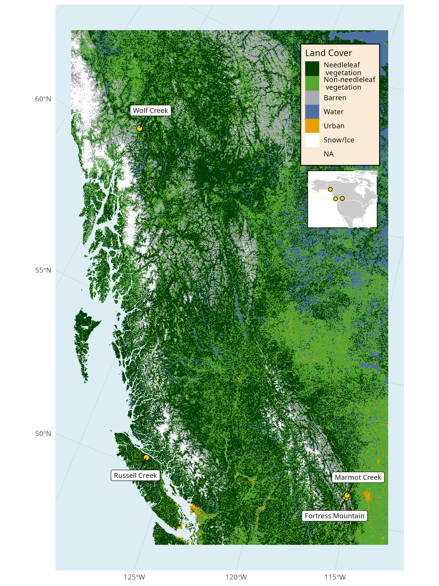
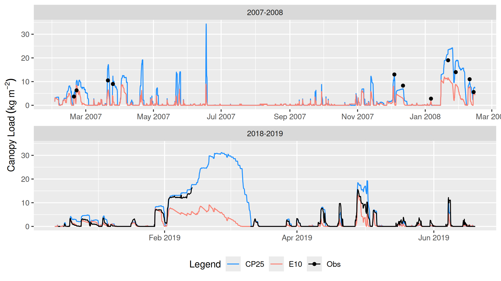
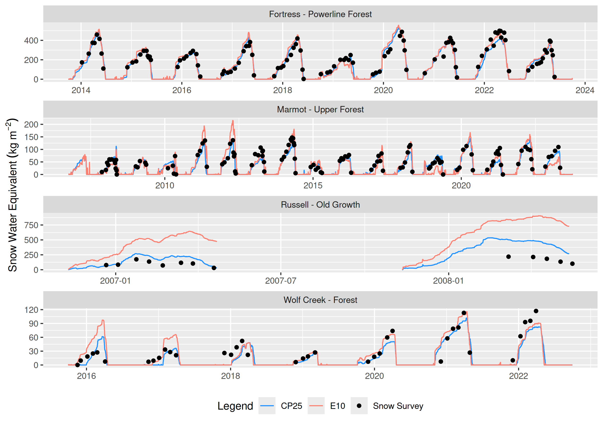
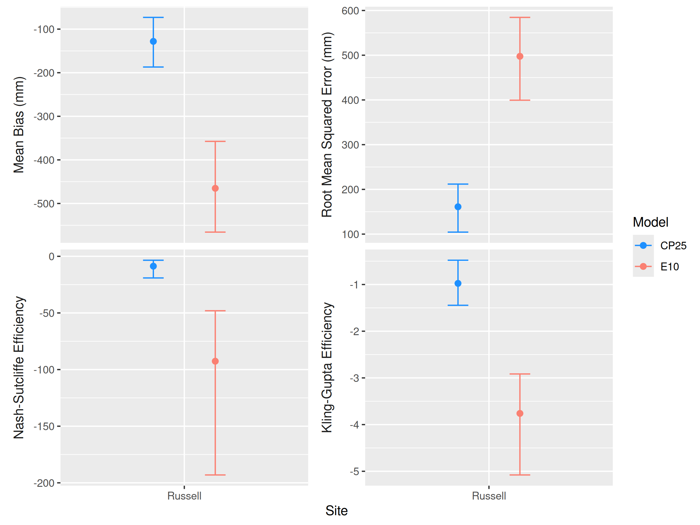
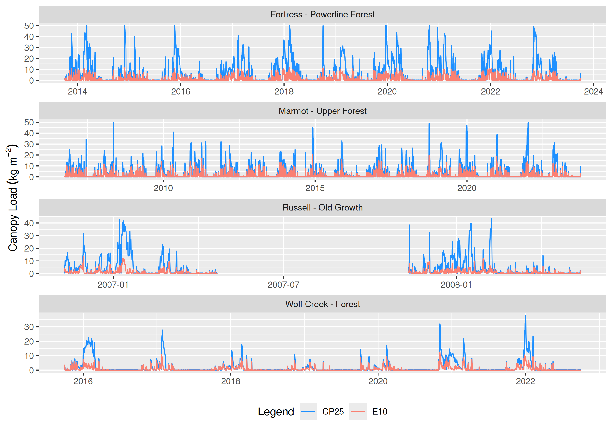
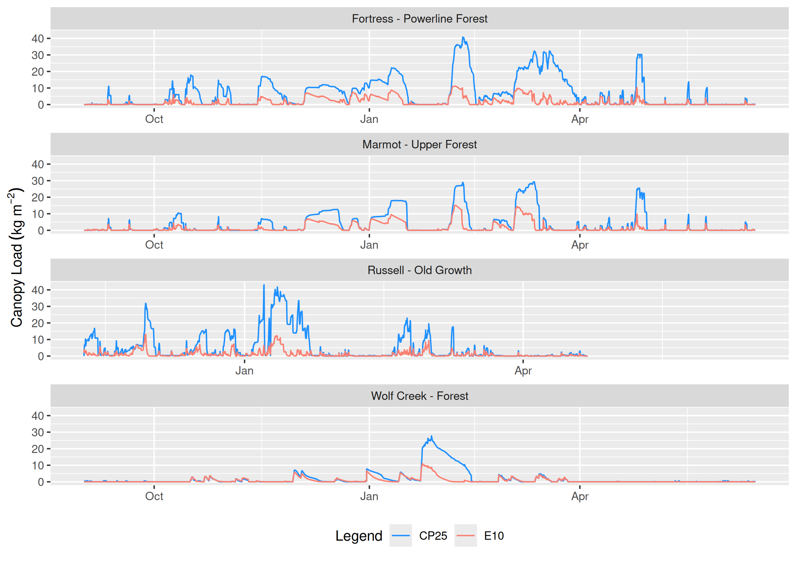
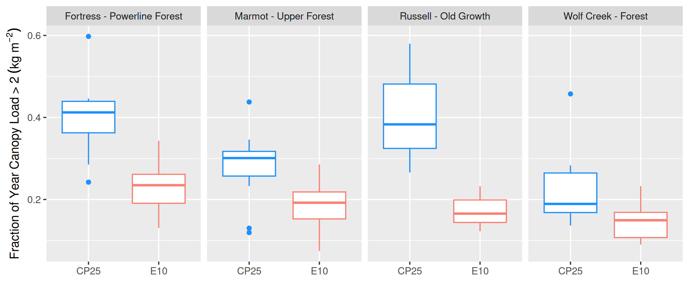

<!-- note this script wont run on its own because we have set all paths relative to the main index file one level up where it is run from  -->

```{r, include=FALSE}
knitr::opts_chunk$set(echo = FALSE, message=FALSE, warning=FALSE, fig.align='center')

setwd('/home/alex/local-usask/working-papers/model-eval-paper/')

source('scripts/get-manuscript-values.R')

```

## Evaluation of New Snow Interception and Canopy Snow Ablation Parameterisations for Partitioning Snowfall in Needleleaf Forests {#sec-chapter-5}

Manuscript status: Manuscript and analysis is complete. Anticipated submission is to the journal *Hydrological Processes* Fall, 2025.

Citation: Cebulski, A. C., Pomeroy, J. W., Floyd, W. C. (in prep.). Evaluation of a New Needleleaf Forest Snowpack Model for Diagnosing Snow Accumulation Regimes in Western and Northern Canada. *Hydrological Processes*.

Role in thesis: This article incorporates the new parameterisations of snow interception and canopy snow ablation, developed in Chapters 2–4, into the Cold Regions Hydrological Model (CRHM) platform. The updated parameterisations are evaluated at four research basins in western and northern Canada. The results demonstrate improved simulations of subcanopy SWE, thereby addressing Research Question 4 of Objective 2 concerning the evaluation of the new parameterisations. The processes governing the partitioning of intercepted snow and subcanopy snow accumulation are diagnosed at each of the four sites addressing Research Question 5 of Objective 2.

Generative Artificial Intelligence (GenAI) Transparency Statement: GenAI tools (e.g., ChatGPT, Grammarly, Claude) were used sparingly and responsibly in this chapter to enhance text clarity and support code debugging.

A.C. Cebulski: Conceptualization (lead), analysis (lead), visualization (lead), writing – original draft (lead), writing review and editing (equal)\
J.W. Pomeroy: Conceptualization (supporting), funding acquisition (lead), analysis (supporting), project administration (lead), resources (lead), supervision (lead), writing review and editing (equal)\
W.C. Floyd: Conceptualization (supporting), analysis (supporting), writing review and editing (equal)

## Abstract

Snow falls in forests over 23% of the global land mass where snow interception and canopy snow ablation processes influence snow accumulation and land-surface energy exchanges. These processes are strongly influenced by both meteorological conditions and canopy density, resulting in differing process emergence across existing theories, depending on the environments in which they were developed, and limited transferability to new regions. Recent studies have revealed new relationships to represent snow interception and canopy snow ablation processes applicable across a broader range of canopy structures and meteorologies. To assess the effectiveness of these new parameterisations across differing climate and forests, both novel and traditional routines were implemented in the Cold Regions Hydrological Modelling platform and evaluated against observations of canopy and subcanopy snow water equivalent across four Canadian sites: two continental climate sites (Marmot Creek and Fortress Mountain, Alberta), one subarctic site (Wolf Creek, Yukon Territory), and one temperature-maritime site (Russell Creek, British Columbia). The observed fraction of seasonal snowfall stored in the subcanopy snowpack at peak SWE varied from 0.3 at Russell Creek, 0.4 at Marmot and Wolf Creek, and 0.6 at Fortress Mountain. Uncalibrated simulation of canopy snow-covered duration at Marmot Creek improved with the new model, where the fractional differences from observations decreased from `r cpy_load_frac_yr$percent_change_e10_obs |> round(1)`% to `r cpy_load_frac_yr$percent_change_cp25_obs |> round(1)`%. The new model demonstrated substantially improved simulation of subcanopy snow accumulation, with mean bias dropping from `r e10_mb |> round(1)` to `r cp25_mb |> round(2)` kg m^-2^ across the four sites. The new model also enabled a more robust diagnosis of how climate and vegetation types influence the processes governing snow partitioning in needleleaf canopies.

## Introduction

Snow is an important water resource, directly supporting over two billion people globally [@Immerzeel2020; @Viviroli2020], while also affecting the Earth's energy balance via surface albedo [@Thackeray2014; @Wang2016], surface temperature [@Pomeroy2016a], soil temperature [@Zhang2018], and stream temperatures [@Leach2014]. However, snowpacks are increasingly threatened due to changes in both climate and vegetation cover worldwide [@Lopez-Moreno2014; @Immerzeel2020; @Viviroli2020]. Hydrological models are essential tools for understanding how climate and vegetation influence snow processes and downstream water resources, and their accuracy depends on accurate representations of forest-snow processes. Snow falls in forested areas over half of the Northern Hemisphere [@Kim2017] and over 23% of land mass globally [@Deschamps-Berger2025], spanning diverse climates and forest structures, highlighting the need for robust, transferable models. In cold-dry climates, sublimation of snow intercepted by forest canopies can return up to 45% of seasonal snowfall back to the atmosphere [@Essery2003; @Sanmiguel-Vallelado2017], whereas in temperate-maritime climates sublimation is less prevalent and a large fraction of snowfall melts in the canopy [@Storck2002]. Yet, uncertainties in forest-snow process representation lead to variable transferability across climates and forest types when simulating subcanopy snow water equivalent (SWE) [@Essery2003; @Gelfan2004; @Rutter2009; @Krinner2018] and diagnosing snow processes [@Lundquist2021; @Lumbrazo2022]. The strong dependence of snowfall partitioning on meteorology and canopy density compounds this variability [@Storck2002; @Pomeroy1998b; @Staines2023; @Mazzotti2021; @Rojas-Heredia2024], challenging earlier canopy snow parameterisations developed from limited observations and leading to distinct process emergence across differing environmental conditions [@Lundquist2021]. While simulating SWE in forests remains challenging, it is a crucial aspect to understanding the impacts of climate and land cover changes on water resources in many forested cold regions across the globe. 

Recent studies have advanced understanding of the canopy snow energy and mass balance across a broader range in meteorological conditions and canopy structures (see @sec-chapter-3 and @sec-chapter-4; Lumbrazo et al., 2022; Lundquist et al., 2021; Mazzotti et al., 2021), with potential to improve SWE simulations in more diverse forested basins. For example, @Lundquist2021 demonstrated that calculating throughfall as a function of antecedent snow load can overestimate the amount of snow reaching the ground—when also combined with a comprehensive canopy snow unloading routine. Building on this, @Staines2023 and @sec-chapter-3 showed that initial interception can be predicted as a function of canopy density without assuming maximum canopy snow load. Moreover, @Roesch2001 and @Lumbrazo2022 showed the importance of representing both wind and melt-induced unloading for representing canopy snow ablation. A new physically-based canopy snow mass and energy balance developed in @sec-chapter-4 provided improved representation of canopy snow ablation compared to previous approaches that were either missing key processes such as dry snow unloading [@Andreadis2009] or were based on empirical relationships such as ice-bulb temperature indexed melt unloading and drip [@Ellis2010]. These advances have been implemented as new parameterisations in the Cold Regions Hydrological Modelling Platform [@Pomeroy2022] to answer the following research questions:

1. What is the fraction of seasonal snowfall stored in the subcanopy snowpack across forests with differing climate and forest types?
2. How accurately does a novel hydrological model simulate canopy and subcanopy SWE across varying forest types and climates compared to a conventional model?
3. What are the canopy snow processes that account for the differences in subcanopy SWE between the modelling approaches, and how do these processes differ with forest structure and climate?

The objective of this research is to evaluate new snow interception and ablation parameterisations for simulating canopy and subcanopy SWE and to diagnose the processes governing snow accumulation in needleleaf forests. Evaluation of the new model in simulating initial accumulation of snow in the canopy has been addressed in @sec-chapter-3 and canopy snow ablation in @sec-chapter-4.

## Methods

### Study Sites

The model evaluation was conducted at four locations in western and northern Canada spanning a range of climate and forest types (@fig-map; @tbl-site-meta). The model simulation years for each site are shown in @tbl-site-meta and were selected based on the availability of subcanopy SWE measurements and hourly station-based observations of air temperature, relative humidity, wind speed, total precipitation, and net solar radiation adjacent to the snow survey transects. At each site, snow surveys consisted of snow depth measurements at all locations and snow density measurements at one out of every five locations. SWE was calculated from snow depth and snow density following the methods outlined in @Pomeroy1995. The four study sites include:

Wolf Creek Research Basin - Forest Site (60.60°N, 134.96°W, 750 m asl.) is located 16 km south of Whitehorse, Yukon Territory in a level dense forest with a sub-arctic climate [see basin scale location in Fig. 1 in @Rasouli2019]. Snow surveys were conducted along a transect that traverses through mature forest consisting of primarily White spruce (*Picea glauca*) and Lodgepole pine (*Pinus contorta*). Additional details on the snow survey and meteorological measurements is described in @Rasouli2019. 
  
Russell Creek Experimental Watershed - Upper Stephanie Old Growth Site (50.32°N, 126.35°W, 700 m asl.) is located on northern Vancouver Island, British Columbia in a temperate-maritime climate that receives substantial precipitation (>2000 mm/yr, @fig-met-normals). Snow survey transects were conducted in cardinal directions within a mature old growth forest that consists of Amabilis fir (*Abies amabilis*) and Western hemlock (*Tsuga heterophylla*) [@Floyd2012]. Additional details on the snow survey and meteorological instrumentation are provided in @Floyd2012. Total precipitation data were unavailable at the Russell site for the 2008 water year. For this period, records from the Tsitika Summit station (50.28°N, 126.36°W; 450 m asl.), operated by the British Columbia Ministry of Transport and located 5 km from Russell, were used instead.
  
Fortress Mountain Research Basin - Powerline site (50.83°N, 115.20°W, 2100 m asl., Kananaskis, Alberta) is located on a wind-exposed subalpine ridge top covered with sparse forest with a continental climate [see basin scale location in Fig. X in @Pomeroy2025]. The vegetation at this site consists of coexisting mature subalpine fir (*Abies lasiocarpa*) and Engelmann spruce (*Picea engelmannii*) tree species [@Langs2020]. Snow survey measurements of snow depth and density were collected following a transect through mature forest east of the Powerline meteorological tower (see @fig-site-map in @sec-chapter-3) and described in further detail in @Pomeroy2025. The meteorological forcing data used in this study is described in detail in @sec-chapter-4. An evaluation of the new canopy snow model on canopy snow load observations was presented in @sec-chapter-3 and @sec-chapter-4 at Fortress Mountain.

Marmot Creek Research Basin - Upper Forest site (50.93°N, 115.16°W, 1848 m asl., Kananaskis, Alberta) is located on a dense forested plateau with a continental climate 14 km north of Fortress [see basin scale location in Fig. 1 in @Fang2019] but receives much less precipitation (@fig-met-normals). The forest consists primarily of Engelmann spruce (*Picea engelmannii*), subalpine fir (*Abies lasiocarpa*), and lodgepole pine (*Pinus contorta*) species [@Fang2019; @Staines2023]. Snow surveys were conducted following a cardinal transect through mature forest surrounding the "Upper Clearing" meteorological tower [see Fig. 1b in @Staines2023] and described in further detail in @Pomeroy2025. The meteorological forcing data and corresponding instrumentation used from this site are described in @Fang2019 and @Pomeroy2025. Canopy snow load observations were collected within the Upper Forest to validate simulations. A subcanopy lysimeter installed by @MacDonald2010 provided throughfall measurements, which were used with a mass balance calculation (@eq-dwdt-ode in @sec-chapter-2) to estimate canopy snow load for 11 snowfall events between February 2007 and February 2008. A weighed tree lysimeter installed by @Staines2022 on the Upper Forest meteorological tower provided measurements of snow load between December 2018 and June 2019. The weighed tree was scaled from weight to weight per unit area based on snow survey measurements from the two snowfall events reported in @Staines2023 following the methodology outlined in @Pomeroy1993a and @Hedstrom1998.

::: {.landscape}
```{r, echo=FALSE}
#| label: tbl-site-meta
#| tbl-cap: "Simulation period (Years), location, and vegetation characteristics, including canopy cover ($C_c$), leaf area index (LAI), and mean tree height ($\\overline{D_{can}}$), for the four study sites."
#| tbl-colwidths: [12, 6, 14, 14, 17, 6, 7, 7, 20]

site_meta |>
  mutate(
    across(where(is.numeric), round, 2),
    Longitude = abs(Longitude)
    ) |> 
  # select(
  #   Model = name,
  #   Station = station,
  #   MB = `Mean Bias`,
  #   # MAE,
  #   RMSE = `RMS Error`
  # ) |>
  knitr::kable(
    col.names = c(
    "Site Name",
    "Years",
    "Elevation (m)",
    "Latitude (°N)",
    "Longitude (°W)",
    "$C_c$ (-)",
    "LAI (-)",
    "$\\overline{D_{can}}$ (m)",
    "Dominant Species"
  ),
  escape = FALSE
  )

```
:::

{#fig-map width=80%}

{#fig-met-normals}

### Simulation of Subcanopy Snowpack

The Cold Regions Hydrological Modelling Platform (CRHM) was implemented to simulate SWE stored in the canopy and in the subcanopy snowpack, and diagnose processes that partition intercepted snow at each of the four forest plots. The CRHM platform is described in detail by @Pomeroy2022. The up-to-date source code is available at https://github.com/srlabUsask/crhmcode, and the version used in this manuscript is archived at @CRHM2025. Hourly climate forcing data from station-based measurements of air temperature, relative humidity, wind speed, total precipitation, and above canopy incoming solar radiation were used to run the CRHM models. Incoming solar radiation observations were not available for Wolf Creek and were simulated following theoretical clear-sky radiation by @Garnier1970 and atmospheric transmittance by @Shook2011 using an adaptation of the method developed by @Annandale2002.

Precipitation phase was determined following the psychometric energy balance approach of @Harder2013 which accounts for the influence of temperature and humidity on precipitation phase. The canopy snow mass and energy balance was treated using two different approaches. An updated approach following new relationships presented in @sec-chapter-3 and @sec-chapter-4 hereafter called "CP25" to represent the canopy snow energy and mass balance (see @sec-appdx-ch5 for a description of the changes to CRHM to implement the new CP25 model). This new approach simulates initial interception of snow in the canopy as a function of canopy density and hydrometeor trajectory angle (@sec-chapter-3) and subsequent ablation of snow intercepted in the canopy by melt and dry-snow unloading (@sec-chapter-4), energy balance-based snowmelt (@sec-chapter-4), and energy balance-based sublimation [@Essery2003]. The terminal fall velocity of hydrometeors used in the initial snow interception parameterisation was assumed to be constant at 0.8 m s^-1^, based on observations reported in @sec-chapter-3 and @Isyumov1971. The shear stress used in the canopy snow unloading parameterisation was approximated as the square of wind speed multiplied by an empirically derived correction factor which was obtained from observations at Fortress Mountain presented in @sec-chapter-4. A second approach hereafter called "E10" which is based on observations by @Hedstrom1998, @Pomeroy1998b, and @Floyd2012; and implemented as described in @Ellis2010. E10 calculates initial interception of snow in the canopy as a function of canopy density, antecedent snow load, and a species dependent storage capacity following @Hedstrom1998. Ablation of snow intercepted in the canopy is determined by dry snow unloading [function of canopy snow load as in @Hedstrom1998], unloading due to melt [@Ellis2010], canopy snowmelt drainage [threshold function of ice-bulb temperature as in @Ellis2010], and sublimation by an analytical energy balance-based parameterisation [@Pomeroy1998b]. See @sec-chapter-2 for a complete description of the E10 parameterisation. While neither the E10 nor CP25 model was calibrated for this study, their parameterisations were originally developed using data from Marmot and sites in Prince Albert National Park, northern Saskatchewan (E10) and Fortress (CP25).

A two-layer energy and mass balance snowmelt model [Snobal, @Marks1998] was used to calculate subcanopy snowpack evolution. Net shortwave radiation to the subcanopy snowpack was simulated by calculating the transmittance of irradiance through the canopy, less the amount reflected from the snow surface [@Pomeroy2009; @Ellis2010]. Incoming longwave radiation to subcanopy snow was simulated by thermal emissions from the atmosphere and vegetation elements, weighted by sky-view-factor [@Ellis2010; @Pomeroy2009]. Sensible and latent heat fluxes to the subcanopy snowpack were determined using an approach adopted from @Brutsaert1982 and @Marks1992 and is described in the CRHM source code. Only two water years were simulated at Russell due to limited model forcing and validation data.

### Model Evaluation

Simulated canopy snow load at Marmot Creek and subcanopy SWE at the four forest plots by the two models (E10 and CP25) was evaluated using observations. The performance of the two models was evaluated based on the differences in simulated ($S_i$) and observed ($O_i$) values of SWE using mean bias (MB), root mean squared error (RMSE), Nash-Sutcliffe efficiency [NSE, @Nash1970], and Kling-Gupta Efficiency (KGE, Gupta et al., 2009; Clark et al., 2021) as:

$$
\text{MB} = \frac{1}{n} \sum^n_{i=1}(S_i-O_i)
$$ {#eq-mb}


$$
\text{RMSE} = \sqrt{\frac{\sum^n_{i=1}(S_i-O_i)^2}{n}}
$$ {#eq-rmse}

$$
\text{NSE} = 1 - \frac{\sum_{i=1}^{n} (S_i - O_i)^2}{\sum_{i=1}^{n} (O_i - \bar{O})^2}
$$ {#eq-nse}

$$
\text{KGE} = 1 - \sqrt{\left(\frac{\bar{S}}{\bar{O}}-1\right)^2 + (\alpha - 1)^2 + (\rho_p - 1)^2}
$$ {#eq-kge}

where $\bar{O}$ and $\bar{S}$ are the means of the observed and simulated values, respectively, $n$ is the number of observations, $\alpha$ is the ratio of simulated to observed standard deviation, and $\rho_p$ is the Pearson correlation the simulated and observed values. 

Performance metrics were calculated over the full simulation period using all available observations of canopy snow load and subcanopy SWE at each site. To quantify sampling uncertainty associated with the inclusion of potentially influential observations, a bootstrap resampling procedure with replacement (10 000 bootstrap replicates) was applied [@Clark2021]. For the canopy snow load evaluation, snowfall events with observed snow load greater than 1 mm (n = 18) were treated as resampling blocks. For the subcanopy SWE evaluation, individual snow survey observations were used as resampling blocks, due to their low temporal autocorrelation resulting from biweekly or monthly sampling intervals.

## Results 

### Snowpack Observations 

Amongst the sites and years included in the study, accumulation of snowfall below the canopy was less than cumulative snowfall observed in open clearings adjacent to each forest transect (@fig-sf-subcpy-swe). At peak seasonal subcanopy SWE, Fortress had the highest fraction of seasonal snowfall stored in the subcanopy snowpack at `r frac_sf_as_pk_swe_lst[["Fortress - Powerline Forest"]]`, followed by Marmot and Wolf Creek which both had similar fractions at `r frac_sf_as_pk_swe_lst[["Wolf Creek - Forest"]]`, and Russell had the smallest fraction at `r frac_sf_as_pk_swe_lst[["Russell - Old Growth"]]`—when averaged over all years. The variability across years was highest at Wolf Creek ranging from `r frac_sf_as_pk_swe_range[["Wolf Creek - Forest"]]` (@fig-frac-obs-swe). Fortress and Marmot Creek also exhibited substantial variability across years (@fig-frac-obs-swe). In contrast, Russell Creek showed the least variation; however, this assessment is limited by observations from only two winter seasons (@fig-frac-obs-swe). Differences in partitioning of intercepted snow by canopy snow unloading, melt/drip, and sublimation contributed to the observed differences in subcanopy snow accumulation relative to the open clearings across sites and years. At the temperate-maritime Russell site, mid-winter melt events also contributed to these observed differences. @sec-sf-partition presents a diagnosis of the dominant processes that partitioned snowfall across the four different forest plots leading to the observed differences in subcanopy snow accumulation. 

{#fig-sf-subcpy-swe} 

{#fig-frac-obs-swe width=75%} 

\pagebreak

### Canopy Snow Load Evaluation

Canopy snow load was overestimated by CP25 and underestimated by E10, over the two observation periods between February 2007–February 2008 and December 2018–June 2019 at Marmot Creek (@fig-cpy-load-ts). The error in simulated canopy snow load over the two periods was smaller for CP25 with a mean bias of `r cp25_mc_mb_L` kg m^-2^ compared to the E10 mean bias of `r e10_mc_mb_L` kg m^-2^ (@tbl-cpy-load-mb). The CP25 model also produced higher NSE (`r cp25_mc_nse_L`) and KGE (`r cp25_mc_kge_L`) values compared to E10, which had lower NSE (`r e10_mc_nse_L`) and KGE (`r e10_mc_kge_L`) values. CP25 demonstrated improved accuracy across a range of snow loads, while E10 greatly underestimated larger snow loads, as above the species specific canopy holding capacity the E10 model decreases the fraction of new snow that is intercepted in the canopy (@fig-cpy-load-ts). Results from the bootstrap analysis, which resampled different combinations of the 18 canopy snowfall events at Marmot Creek, quantified the sampling uncertainty associated with event selection. Across the resampled datasets, the CP25 model more accurately simulated canopy snow load, as indicated by its higher KGE value (`r cpy_load_boot_kge$CP25`) relative to the poorer performance of E10 (`r cpy_load_boot_kge$E10`) (@fig-cpy-load-boot). The E10 model consistently underestimated canopy snow load, as shown by a positive mean bias across all event combinations. In contrast, CP25 exhibited a smaller negative mean bias that was closer to zero, although it also underestimated snow load for some event combinations, as indicated by the positive upper bound of the 95% confidence interval.

For five events between May and June 2019, characterised by mean air temperatures above 0°C with mixed snowfall and rainfall, canopy snow load was underestimated by both CP25 and E10 (see @sec-appdx-ch5 for a subset of @fig-cpy-load-ts for just these events). Two rainfall events (2019-05-30 and 2019-06-14) were simulated by CRHM entirely as rain. During these events, observed canopy loads reached 2.6–3.0 kg m^-2^, whereas simulated loads were < 0.5 kg m^-2^, close to the liquid storage capacity used in both CP25 and E10. For the remaining three events with mixed snow/rain on 2019-05-15, 2019-05-23, and 2019-06-06 CP25 underestimated peak canopy snow load by `r cp25_rs_hi`% to `r cp25_rs_low`% and E10 by `r e10_rs_hi`% to `r e10_rs_low`%. The underestimation of simulated canopy load by both models over these events is attributed to the liquid storage capacities of canopy snow and vegetation elements, not representing differing unloading rates with increased cohesion/adhesion of snow to the canopy near the melting point, instrument uncertainty in the observations, and errors in the precipitation phase parameterisation.

Over the 2018–2019 period the fraction of the year that the canopy was loaded with >2 kg m^-2^ of snow, was found to be `r cpy_load_frac_yr$Obs |> round(2)`, compared to simulations of `r cpy_load_frac_yr$CP25 |> round(2)` and `r cpy_load_frac_yr$E10 |> round(2)` by the CP25 and E10 models respectively. A threshold of 2 kg m^-2^ was selected based on observations by @Pomeroy1996 who found minimal influence of canopy snow load on above canopy albedo for loads less than 1.6 kg m^-2^. The underestimate of canopy snow cover duration by the E10 model of around `r cpy_load_frac_yr$percent_change_e10_obs |> round(1)`% results from the underestimation of canopy load which depleted the canopy of snow earlier than the observations. The CP25 model slightly overestimated the snow covered duration by `r cpy_load_frac_yr$percent_change_cp25_obs |> round(1)`%, resulting from the overestimates of canopy snow load by CP25 (@fig-cpy-load-ts) which stored canopy snow loads above >2 kg m^-2^ longer than the observations.

{#fig-cpy-load-ts}

{#fig-cpy-load-boot}

\pagebreak

```{r, echo=FALSE}
#| label: tbl-cpy-load-mb
#| tbl-cap: "Mean bias (MB), root mean squared error (RMSE), Nash-Sutcliffe efficiency (NSE), and Kling-Gupta efficiency (KGE) determined from time-series simulations of canopy snow load for the two models CP25 and E10 at Marmot Creek. The final column (n) shows the count of observations used to compute the statistics."
#| tbl-colwidths: [10, 20, 10, 10, 10, 10, 10]

cpy_load_timeseries_err_stats |>
  # arrange(station) |> 
  mutate(
    across(where(is.numeric), round, 2),
        across(where(~ is.numeric(.x) && mean(.x, na.rm = TRUE) > 10), round, 1)
    ) |> 
  select(
    Model = name,
    Year = year,
    # Station = station,
    MB = Mean.Bias,
    # MAE,
    RMSE = RMS.Error,
    # r.2,
    NSE,
    KGE,
    n
  ) |>
  knitr::kable(
    col.names = c(
    "Model",
    "Year",
    "MB",
    # "MAE",
    "RMSE",
    # "$R^2$",
    "NSE",
    "KGE",
    "n"
  )
  )

```

### Subcanopy Snowpack Evaluation

Over all years and sites, the CP25 model had a lower mean bias of `r cp25_mb |> round(2)` kg m^-2^ compared to E10's mean bias of `r e10_mb |> round(1)` kg m^-2^ in representing subcanopy SWE measurements (@tbl-swe-mb). Model errors were lower for the three colder climate sites (i.e., Fortress, Marmot, and Wolf Creek), where CP25 underestimated SWE (MB = `r cp25_no_rc_mb |> round(2)` kg m^-2^) and E10 overestimated SWE (MB = `r e10_no_rc_mb |> round(2)` kg m^-2^). Although E10 had a marginally reduced mean bias at Fortress compared to CP25, the RMSE, NSE, and KGE values were improved across all sites for CP25 reflecting improved accuracy of the new model (@tbl-swe-mb). Three years contributed to the higher RMSE and lower NSE and KGE values by E10 at Marmot where simulated peak SWE was greatly overestimated by over 50 kg m^-2^ (nearly 100% of observed SWE) for the water years 2011 and 2012. In contrast, E10 had a very large underestimation in subcanopy SWE at Marmot for the water year 2019. At Wolf Creek, E10 also had deviations of ~30 kg m^-2^ (~100% greater than observed SWE) from peak SWE for 2016 and 2017. At Russell Creek, errors were lower for both CP25 and E10 during the first winter season than the second. This difference may be explained by a higher frequency of cold snowfall events during the first year, when air temperatures frequently dropped below −10 °C, compared with the second year when temperatures did not fall below −8 °C. The colder conditions in the first year were more consistent with those at Fortress Mountain, where the CP25 parameterisations were developed. In contrast, the relatively warmer second winter could have promoted stronger melt-freeze processes, resulting in more cohesive canopy snow, greater canopy retention, and reduced partitioning into solid snow unloading. Although the intent of this evaluation is to assess the performance of each model in simulating subcanopy SWE, uncertainties in model forcing and physical parameters (i.e., canopy coverage, LAI) may also contribute to systematic biases in the evaluation. Some of the increased model error at Russell during the 2008 water year may reflect the use of total precipitation data from a nearby highway station rather than on-site measurements.

Bootstrap resampling revealed clear differences in model performance in simulating subcanopy snow water equivalent (SWE) across the evaluated sites (@fig-swe-boot, @fig-swe-boot-rus). The CP25 model had consistently lower RMSE, KGE, and NSE mean values, as well as a smaller 95% confidence interval, across all four sites. The mean bias statistic differed less between the two models with E10 showing a slightly lower mean bias at Fortress, versus lower mean bias for CP25 at Marmot. Still, the range in mean biases across the differing event combinations for CP25 was smaller showing more stable performance. Across the three cold climate sites (Fortress, Marmot, and Wolf Creek) the greatest deviation in the error statistics between the two models was observed at Marmot Creek, with improved accuracy for the CP25 model and less difference in performance at Fortress and Wolf Creek. Both CP25 and E10 had higher errors at Russell Creek compared to the colder climate sites, though CP25 still had substantially greater accuracy compared to CP25 due to a better representation of canopy snow ablation processes (@fig-swe-boot-rus).

```{r, echo=FALSE}
#| label: tbl-swe-mb
#| tbl-cap: "Mean bias (MB), root mean squared error (RMSE), Nash-Sutcliffe efficiency (NSE), and Kling-Gupta efficiency (KGE) determined from time-series simulations of snow water equivalent for the two canopy snow models at each of the four sites. The final column (n) shows the count of observations used to compute the statistics."
#| tbl-colwidths: [10, 30, 10, 10, 10, 10, 10]

swe_timeseries_err_stats |>
  # arrange(station) |> 
  mutate(
    across(where(is.numeric), round, 2),
        across(where(~ is.numeric(.x) && mean(.x, na.rm = TRUE) > 10), round, 1)
    ) |> 
  select(
    Model = name,
    Station = station,
    MB = Mean.Bias,
    # MAE,
    RMSE = RMS.Error,
    # r.2,
    NSE,
    KGE,
    n
  ) |>
  arrange(Station) |> 
  knitr::kable()

```

The evolution of season subcanopy SWE was generally well represented by both models at Fortress, Marmot, and Wolf Creek (@fig-swe-ts). However, E10 failed to simulate the timing of SWE accumulation and ablation well for 2011, 2012, and 2019 at Marmot. The largest deviation in simulated seasonal SWE occurred at Russell Creek for E10 where subcanopy snow accumulation was simulated at a much higher rate compared to that observed and estimated by CP25 over the two years that were simulated. At Wolf Creek, CP25 had a delay in simulating the initial accumulation of subcanopy SWE for water years 2017, 2018, and 2019. The lower snowfall rate at Wolf Creek and higher interception rate for CP25 compared to E10 led to throughfall and unloading rates that were smaller than the snowpack initiation threshold employed in Snobal, causing simulated SWE below this threshold to melt immediately. In contrast, E10 intercepted less snow and had higher unloading rates than CP25 leading to higher initial accumulation for these three years at Wolf Creek.

{#fig-swe-ts}

{#fig-swe-boot}

{#fig-swe-boot-rus}

\pagebreak

### Snowfall Partitioning {#sec-sf-partition}

A greater fraction of annual snowfall was sublimated by CP25 compared to E10 for all four sites across all years (@fig-frac-cpy-proc). Lower interception efficiency combined with higher average rates of unloading for the E10 model led to more snowfall being partitioned towards the ground compared to the CP25 model (@fig-frac-cpy-proc) leading to reduced sublimation of canopy snow and underprediction of canopy SWE (@tbl-cpy-load-mb) and overprediction of subcanopy SWE accumulation (@tbl-swe-mb). The underprediction of subcanopy SWE by the CP25 model at Fortress, Marmot, and Wolf Creek (@tbl-swe-mb) may have been due to an overestimate of sublimation and/or canopy snowmelt rates leading to less snowfall being partitioned to the ground as solid snow. The difference in the annual fraction of snowfall that was sublimated between the CP25 and E10 models was most prevalent at Marmot (@fig-frac-cpy-proc). Factors that may contribute to this large deviation include the lower unloading rates observed for CP25 at this site (@fig-frac-cpy-proc) compared to E10 resulting from the lower wind speed and air temperatures at this site (@fig-met-normals), reducing the unloading and canopy snowmelt rates thus increasing the amount of canopy snow subject to sublimation for CP25. At Marmot Creek, the monthly air temperature normals between April and June—when this site receives most of its snowfall (@fig-met-normals)—are also largely within the E10 ice-bulb temperature unloading range (-3°C to 6°C) for initiating unloading due to warming. Relatively similar fractions of annual snowfall were sublimated by the two models at Fortress and Wolf Creek (@fig-frac-cpy-proc) due to the general agreement in the two sublimation parameterisation by the two models combined with the similar fraction of snow partitioned towards the ground (@fig-frac-cpy-proc). The drip/melt fraction simulated by E10 was near zero for all four sites, while CP25 had fractions ranging between 0.1 to 0.38 (@fig-frac-cpy-proc). Incorrectly partitioning canopy snow ablation to the ground entirely as solid snow unloading in the E10 model also contributed to the overestimation of subcanopy SWE (@tbl-swe-mb). Process observations of unloading, melt, and sublimation were not available and thus the simulations of snowfall partitioning could not be directly evaluated. 

![Boxplots showing the distribution of the fraction of total atmospheric snowfall that was sublimated out of the canopy (top row), reached the subcanopy via unloading and/or throughfall (middle row), and melted in the canopy (bottom row) at each station. Note: the rectangle vertical extent represents the interquartile range (25^th^ to 75^th^ percentile), the horizontal line within each box indicates the median, and the whiskers extend to 1.5 times the interquartile range. Circular points beyond the whiskers represent outliers.](figs/final/figure10.png){#fig-frac-cpy-proc}

\pagebreak

### Simulated Canopy Snow Load

Over all years and sites, CP25 predicted consistently higher canopy snow loads compared to the E10 model (@fig-cpy-swe). This was due to E10's increase in throughfall with increasing antecedent snow load as well as the unloading rate as a function of snow load and ice-bulb temperature which led to less snow residing in the canopy compared to CP25 (@fig-frac-cpy-proc). Some snowfall events had similar initial accumulation of snow in the canopy between the two models up until the E10 species snow load capacity was reached (see events in Jan and Feb at Fortress, Marmot, and Wolf Creek in @fig-cpy-swe-select).

{#fig-cpy-swe}

{#fig-cpy-swe-select}

\pagebreak

In addition to the large difference in canopy load predicted by CP25 and E10 across all four sites, the duration that the canopies of each site were simulated to have more than 2 kg m^-2^ of snow varied between the four sites and two models (@fig-frac-cpy-load-th). Across all four sites, canopy loads greater than 2 kg m^-2^ were observed to persist longer for CP25 compared to E10 (@fig-frac-cpy-load-th). The largest differences between the two models occurred at Russell and Fortress, where snow loads exceeding this threshold persisted `r frac_yr_cpy_snow_list[[rc]]`% and `r frac_yr_cpy_snow_list[[fm]]`% longer in CP25 than in E10. At Marmot and Wolf Creek, the relative differences were smaller—`r frac_yr_cpy_snow_list[[mc]]`% and `r frac_yr_cpy_snow_list[[wc]]`%—due to lower snowfall and canopy snow loads at these sites, resulting in slightly higher interception efficiencies for the E10 model.

{#fig-frac-cpy-load-th}

## Discussion

### Model Performance

New parameterisations of the canopy snow energy and mass balance—supported by advances in process understanding in @sec-chapter-3 and @sec-chapter-4 and other recent studies [e.g., @Lundquist2021; @Staines2023]—were evaluated for their ability to simulate SWE stored within and below the canopy. Inclusion of both dry- and melt-induced unloading is supported by @sec-chapter-4 and many other studies (Ellis et al., 2010; Floyd, 2012; Lumbrazo et al., 2022; Roesch et al., 2001), with mechanisms such as bond weakening, lubrication during melt, and wind shear reinforcing their physical basis. An energy balance-based canopy snowmelt routine—recommended by @sec-chapter-4 and many other studies (Andreadis et al., 2009; Lumbrazo et al., 2022; Lundquist et al., 2021; Storck et al., 2002) also contributed to improved accuracy of simulated canopy and subcanopy SWE. The higher canopy snow loads simulated by the new model are consistent with empirical observations in this study and others (Calder, 1990; Hedstrom & Pomeroy, 1998; Storck et al., 2002; Watanabe & Ozeki, 1964), which demonstrate a linear increase in interception with snowfall and limited evidence of a maximum capacity. Specifically, simulated canopy snow loads reaching close to 50 kg m^-2^ are consistent with observations in coastal environments by @Storck2002 and @Floyd2012. By calculating throughfall as a function of canopy density (@sec-chapter-3; Staines & Pomeroy, 2023) and combining this with a comprehensive canopy snow ablation routine (@sec-chapter-4; Lundquist et al., 2021), results from @sec-chapter-3 and @tbl-cpy-load-mb showed canopy snow loads simulated using the new initial interception parameterisation were more representative of observations. Calculating throughfall as a function of antecedent snow load, as implemented in the E10 model, combined with unloading rates parameterised by ice-bulb temperature and/or canopy snow load, resulted in underestimation of both the amount and duration of snow intercepted in the canopy. While the new model reduced errors in simulated snow load (@fig-cpy-load-boot), canopy snow loads were generally overestimated compared to observations at Marmot Creek for cold snow events and suggests dry-snow unloading rates may be higher in this forest. For mixed rain/snow events canopy snow load was underestimated by the new model and E10 due to underestimates in the liquid water storage capacity and/or overestimates in canopy snow ablation during these events. The liquid water storage capacities for both models were computed using @eq-liq-hold-cap from @sec-chapter-4, suggesting that the coefficients in this equation may require adjustment for this forest site. Rainfall interception studies have demonstrated that the canopy water storage capacity varies across forest age classes [@Pypker2005] and species [@Xiao2016]. However, further research is needed to understand how liquid water storage capacity differs amongst species and age classes, and how these differences manifest under varying levels of intercepted snow. Moreover, the unloading rates over these warmer events may be lower compared to the coefficients developed at Fortress Mountain in @sec-chapter-4, potentially due to increases in cohesion and adhesion of snow to the canopy due to increases in liquid water content and/or melt-freeze processes within the canopy. @Lumbrazo2022 also showed that parameters for unloading are site specific and may suggest the initial interception parameters or model process conceptions are as well. However, the large improvement in both the uncalibrated simulation of canopy snow load and canopy snow covered duration by the new model provides some evidence of increased transferability across differing forest canopies. Despite some discrepancies in simulating canopy snow load at Marmot Creek, the new model more closely approximated the duration the canopy was covered with more than 2 kg m^-2^ of snow—based on the threshold identified by @Pomeroy1996 to be sufficient to impact above canopy albedo—reducing error compared to an existing model by a factor of four. 

The improved representation of canopy snow ablation as demonstrated in @sec-chapter-4 at Fortress Mountain for individual snowfall events under warm conditions likely contributed to significant reduction in simulated subcanopy SWE errors at the temperate-maritime Russell site. In contrast, the E10 ice-bulb temperature-based melt threshold (> 6 °C) was infrequently reached and caused ablation to occur mainly as solid snow unloading rather than drip. Overestimates of canopy snow unloading during both dry-snow and melt-driven conditions by the E10 model led to overpredicted subcanopy SWE, as less intercepted snow was exposed to sublimation or melt (@tbl-swe-mb). Low error in the new model simulated subcanopy SWE at the cold sites (i.e., Fortress, Marmot, and Wolf Creek) suggests that the dry snow unloading parameterisation is transferable across sites and is consistent with observations by @Lumbrazo2022, where a wind-driven unloading parameterisation had good accuracy across differing cold-climate sites. Despite relatively similar mean biases in subcanopy SWE simulations across the cold-climate sites (@tbl-swe-mb), the new model had reduced RMSE and higher KGE and NSE values. This resulted from an improved representation of snow interception and canopy snow ablation processes which better captured the variation in snowfall partitioning over years with differing snowfall amounts and meteorology. Both the new model and E10 model performed worst at the temperate-maritime Russell site—although the new model showed large improvements over E10—where melt/drip and melt-induced unloading processes dominated. Remaining error at Russell may reflect unrepresented processes, such as ice accretion from canopy snow melt-freeze cycles and rime-ice deposition as observed in other maritime forests [@Lumbrazo2022], which can increase canopy loads, lower unloading rates and favour partitioning to liquid water. Additional uncertainties stem from simplifications in the canopy energy balance (e.g., radiation transmittance, longwave emission, and turbulent fluxes), as well as parameterisations of interception and unloading. These issues are likely amplified at Russell, where frequent air temperatures near the melting point cause large changes in enthalpy which increase phase change sensitivity to energy balance formulations, compared to the colder sites with more stable enthalpy conditions. Some errors in subcanopy SWE simulations are also attributed to limitations in the subcanopy snowpack energy and mass balance routine (i.e., Snobal). For instance, a minimum accumulation threshold caused discrepancies in subcanopy SWE simulations at Wolf Creek.

The hydrometeor fall velocity and wind shear stress used in the initial interception and canopy snow unloading parameterisations, respectively, were estimated using simplified approximations that introduced error into the new model's results at all four sites. For instance, a fixed hydrometeor fall velocity was used at all four sites based on empirical observations from @sec-chapter-3 and @Isyumov1971. This approximation increases uncertainty in the initial interception calculation due to the associated sensitivity of wind speed and hydrometeor fall velocity with snow-leaf contact area. Furthermore, midcanopy shear stress was approximated using an empirical relationship with midcanopy wind speed developed in @sec-chapter-4. The use of more physically based formulations that account for variations in shear stress resulting from differences in air density and/or within-canopy wind flow [@Stull2017] could further improve estimates of shear stress and, consequently, unloading.

The new model simulated much longer periods of canopy load greater than 2 kg m^-2^ and improved accuracy at Marmot Creek compared to an existing approach (@tbl-cpy-load-mb). This has implications for the representation of above-canopy albedo in land surface models which have previously shown poor performance with existing canopy snow ablation models [@Thackeray2014; @Wang2016]. Moreover, E10’s performance in simulating subcanopy SWE varied substantially between years; it overestimated SWE over most years, but underestimated SWE in low-snowfall years when reduced unloading rates allowed more sublimation (e.g., Marmot in 2019; @fig-swe-ts). These results show that recent improvements in process parameterisations—particularly the treatment of canopy load, ablation, and unloading—yield measurable improvements in simulating canopy and subcanopy SWE across diverse climates and forest types.

### Influence of Climate on Snowfall Partitioning 

Although Russell and Fortress received similar amounts of snowfall (@fig-sf-subcpy-swe), subcanopy accumulation was 50% lower at Russell due to greater canopy snowmelt: ~40% of annual snowfall melted and 20% sublimated in the canopy, compared to ~35% combined melt and sublimation of intercepted snow at Fortress. The low cold content of the maritime snowpack at Russell led to canopy snow meltwater rarely refreezing, and warmer air temperatures (@fig-met-normals) further promoted melt of the subcanopy snowpack throughout the season reducing subcanopy snowpack accumulation (@fig-swe-ts). The prevalence of snowmelt both in the canopy and on the ground at Russell led to the lowest fraction of seasonal snowfall stored as subcanopy snow accumulation at peak SWE. Russell also observed the lowest amount of canopy snow sublimation as most ablation occurred as melt and solid snow unloading. Frequent mid-winter canopy snowmelt also provided a steady year-round input of drip to the subcanopy, which recharges soil moisture and groundwater, and promotes runoff generation [@Groff2025; @Hayashi2020; @Barnhart2016]. At Fortress, colder conditions, higher seasonal snowfall, and greater wind exposure increased unloading rates and limited canopy snow sublimation (@fig-frac-cpy-proc). Combined with low canopy melt (@fig-frac-cpy-proc), these processes at Fortress yielded the highest subcanopy accumulation (0.6) across all four sites.

Marmot and Wolf Creek experienced cooler, drier conditions with calm winds and lower seasonal snowfall, leading to reduced unloading and increased the fraction of snowfall that was sublimated from the canopy (@fig-frac-cpy-proc). This, coupled with canopy snowmelt playing a minor role in partitioning intercepted snow meant that only ~0.4 of snowfall accumulated as subcanopy snowpack at peak SWE. Simulated sublimation for these two sites (~50% of seasonal snowfall; @fig-frac-cpy-proc) exceeded the upper range of global estimates (25–45%) reported by @Essery2003 but is consistent with observations by @Pomeroy1995, @Pomeroy1998b, and @Ellis2010. The agreement in the new model and E10 in partitioning snowfall between sublimation and unloading at Fortress and Wolf Creek arises because the E10 routine unloads a similar fraction of annual snowfall as the new model despite having different parameterisations for unloading and sublimation. For the two sublimation schemes, E10 omits longwave radiation from the canopy snow sublimation energy balance [@Pomeroy1998b], while parameterisation used in the new model includes longwave radiation [@Essery2003]. This consistency between the two sublimation parameterisations was also observed in @sec-chapter-4 during several sublimation-dominated ablation events.

### Influence of Tree Species on Snowfall Partitioning

The species of needleleaf forest overlying each site also influenced subcanopy SWE accumulation. However, limited research has been conducted on how branch elasticity, needle composition, and crown structure between differing species and ages affect the interception and ablation of snow. The Marmot and Wolf Creek sites, both primarily composed of spruce trees (@tbl-site-meta) and exposed to similarly cool climates (@fig-met-normals), showed comparable fractions of snowfall stored in the subcanopy and similar canopy melt and sublimation losses (@fig-frac-cpy-proc; @fig-frac-cpy-proc). In contrast, Fortress and Russell were both primarily fir-dominated forests, yet diverged strongly due to climate differences (@fig-met-normals) and vegetation structure. Even though Russell had approximately 20% more canopy cover than Fortress, it accumulated only about half as much snowfall beneath the canopy. Tree size is a likely factor, large 50 m tall fir trees at Russell can intercept far more snow than the smaller 10 m fir trees at Fortress. Coupled with low wind speeds, this increased exposure of intercepted snow to canopy energy fluxes that favoured melt and drip at Russell Creek. The larger, more supportive branches combined with the differing climatic regime and potential for ice-deposition may also have slowed unloading, contributing to the new model’s overestimate of subcanopy SWE at Russell. These results support earlier theory posed by @Satterlund1970 that vegetation structure, density, and climate exert stronger control on forest-snow partitioning than tree species alone. Moreover, @Schmidt1990 showed that branch temperature rather than species type had the greatest influence on the modulus of elasticity of needleleaf branches and their snow holding capacity. However, other forest types, such as broadleaf deciduous [@Huerta2019], cedar or hemlock stands, or younger trees, with less supportive leaves and branches, may have a stronger influence on canopy-snow processes than the relatively subtle species differences observed amongst needleleaf sites in this study.

## Conclusions

Recent advances in canopy snow energy and mass balance parameterisations were shown to reduce errors in simulated SWE, both within and below the canopy, across forests spanning a range of climates and canopy structures. The revised model also provided a more robust diagnosis of the processes that govern how intercepted snowfall is partitioned between sublimation to the atmosphere, storage in the canopy, drip, and unloading to the forest floor. Building on recent developments, the new approach calculates initial snow interception as a function of canopy density and hydrometeor trajectory angle. Canopy snow ablation is represented by melt- and wind-driven unloading, energy balance-based melt, and sublimation processes that vary with canopy snow load. The revised parameterisations improved simulations of the quantity and duration that snow was intercepted in the canopy compared to an existing approach. Simulation of subcanopy SWE improved across all four sites and is attributed to more accurately representing the canopy snow energy and mass balance in the new model. This was most apparent in a temperate-maritime environment, where errors in subcanopy SWE were a factor of four lower—attributed to a more accurate representation of initial interception, canopy snowmelt, and unloading. These results highlight the robustness of physically based parameterisations under cold continental to warm coastal climates, which is particularly important given that continued warming may reduce the applicability of empirically derived routines.

Process diagnosis conducted with the revised snow interception and canopy snow ablation parameterisations highlighted the role of needleleaf canopies in partitioning intercepted snowfall. The greatest influence was observed in the temperate-maritime forest, where increased energy fluxes to intercepted snow caused nearly half of seasonal snowfall to melt within the canopy, producing the lowest subcanopy SWE fraction of snowfall and a steady contribution of meltwater throughout the winter. Despite the large influence of snowfall partitioning by vegetation on the subcanopy snowpack, sublimation losses were relatively small (~`r frac_subl_lst[[rc]]`% of seasonal snowfall). At two cold continental sites with lower annual snowfall, reduced unloading led to a larger proportion of intercepted snow to be retained in the canopy over longer durations and lost to sublimation (~`r (frac_subl_lst[[mc]]+frac_subl_lst[[mc]])/2`%). In contrast, the cold wind-exposed site with higher snowfall exhibited greater unloading and shorter canopy residence times, which limited sublimation losses relative to the other cold sites. Overall, climate and canopy density exerted stronger controls on seasonal snowfall partitioning than species-level differences between fir-, spruce-, and pine-dominated forests.

Although the new model simulated canopy and subcanopy SWE well, uncertainties remain in partitioning of snowfall between sublimation losses and liquid water inputs to the forest floor, as direct flux measurements have only been validated at one site in a previous study. Measurements of snow interception, unloading, drip, and sublimation are rarely made at hydrometeorological stations but would provide important data to evaluate and refine process-level representations across differing environments. Further research is also needed to determine differences in the unloading relationships across a broad range in climate and forest types. For instance, unloading can be strongly affected by branch elasticity variations with temperature, tree age, and/or tree species. Differing cohesion and adhesion in humid climates may influence how snow is retained or shed from canopies compared to the coefficients implemented here which were developed in a continental climate. Moreover, all four study sites consisted primarily of mature needleleaf forest canopies, and the transferability of these results to more juvenile stands or forests with greater species diversity remains an open area of research. Improved process-level measurements, combined with continued model development, will help to identify these uncertainties and support the transferability of canopy snow models across the wide range of conditions found in snowy forests across the globe.

## Acknowledgements

We acknowledge financial support from the University of Saskatchewan Dean’s Scholarship, the Natural Sciences and Engineering Research Council of Canada’s Discovery Grants, the Canada First Research Excellence Fund’s Global Water Futures Programme, Environment and Climate Change Canada, Alberta Innovates Water Innovation Program, the Canada Foundation for Innovation’s Global Water Futures Observatories facility, and the Canada Research Chairs Programme. We thank Hannah Koslowsky, Kieran Lehan, Lindsey Langs, James MacDonald, Michael Solohub, Jacob Staines, Greg Galloway, Sean Carey, Rosy Tutton, David Barrett, and Tyler De Jong for their help with data collection and Tom Brown and Logan Fang for support of the CRHM platform.

## Data and Software Availability Statement

The Cold Regions Hydrological Model Platform (CRHM) source code used in this study is preserved at https://doi.org/10.5281/zenodo.17981431 [@CRHM2025], available under the GPL-3.0 license, and developed openly at https://github.com/srlabUsask/crhmcode. Model forcing data, model outputs, validation data, processed data, and scripts to run the processing are available at https://doi.org/10.5281/zenodo.17409551 with GPL-3.0 license access conditions.