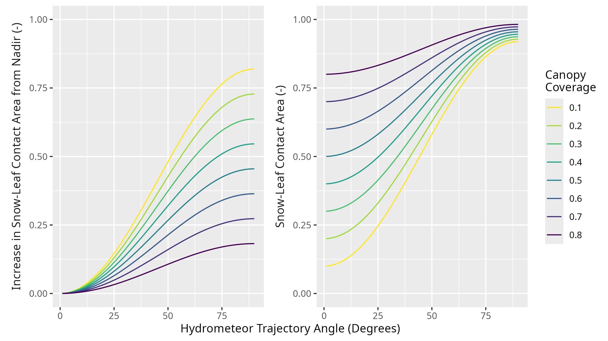
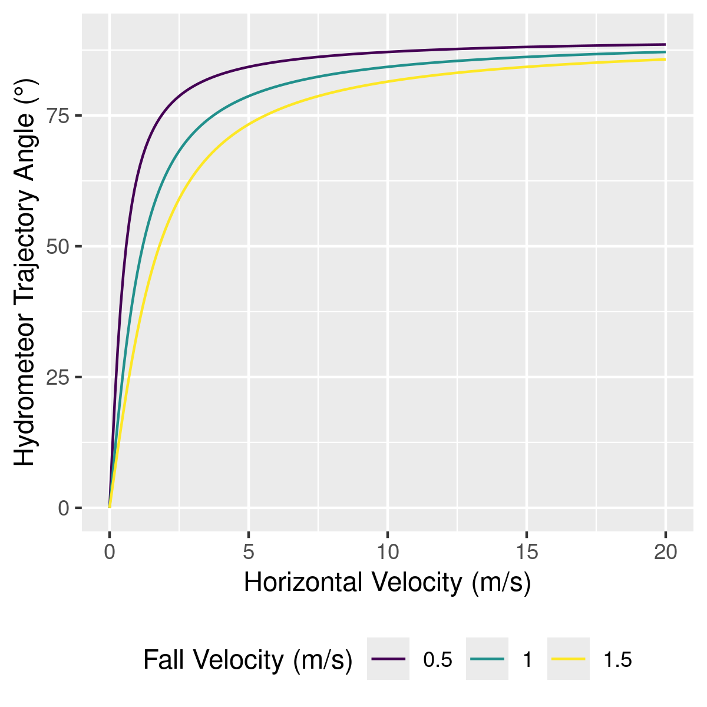
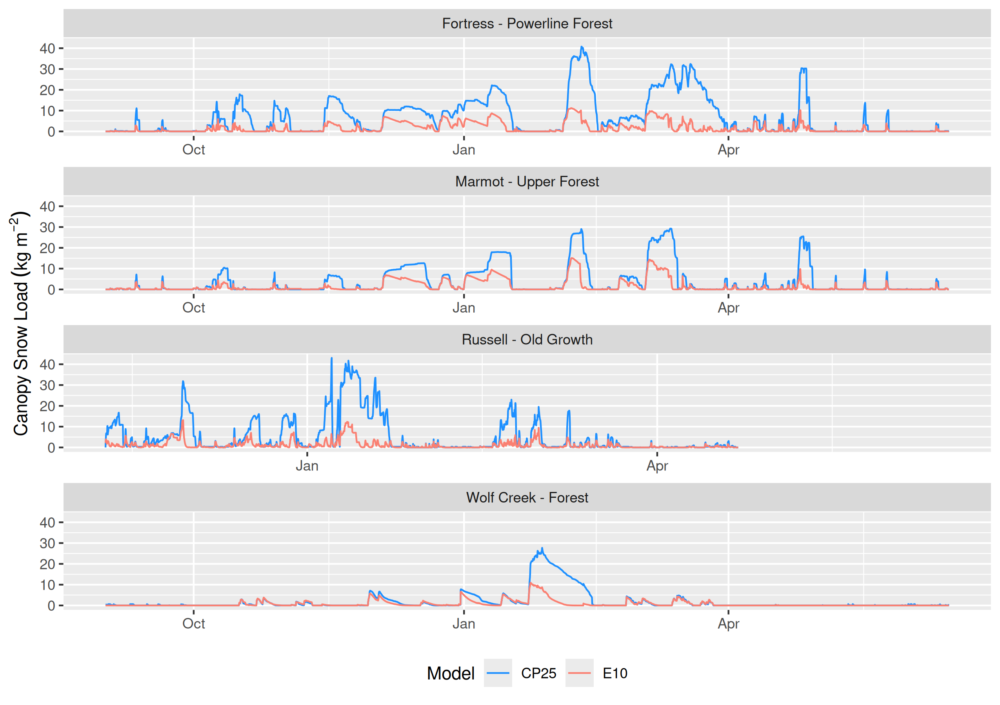

# - Appendix for Chapter 5 {#sec-appdx-ch5}

## Description of New Modules added to the Cold Regions Hydrological Modelling Platform (CRHM)

The following describes the new modules added to the CRHM software as part of this research. The new modules are actively developed in the CRHM repository \href{https://github.com/acebulsk/crhmcode/blob/alex-ceb-thesis-changes}{\color{blue}{here}} and specific changes are documented in pull request \href{https://github.com/srlabUsask/crhmcode/pull/471}{\color{blue}{\#471}}. The version of CRHM used in this manuscript has been permanently archived \href{https://doi.org/10.5281/zenodo.17981431}{\color{blue}{here}}. The CRHM modules listed below are located at the path and point to the version being actively being developed:

\href{https://github.com/acebulsk/crhmcode/blob/alex-ceb-thesis-changes/crhmcode/src/modules}{\color{blue}{https://github.com/acebulsk/crhmcode/blob/alex-ceb-thesis-changes/crhmcode/src/modules}}

### Initial Snow Interception

**Description:**

A new module called `CanopyVectorBased` was added to CRHM to compute initial snow interception in the canopy as described in @sec-chapter-3. This module differs from the existing CRHM `CanopyClearingGap` module based on @Ellis2010 which calculated initial interception as a function of antecedent canopy snow load and canopy density. The new module represents an improvement by calculating initial interception as a function of snowfall and canopy density (function of canopy coverage and hydrometeor trajectory angle) based on observations presented in @sec-chapter-3. The association of interception with canopy snow load is now handled only once by the canopy snow unloading routine in the canopy snow ablation module.

**Modules:**

- \href{https://github.com/acebulsk/crhmcode/blob/alex-ceb-thesis-changes/crhmcode/src/modules/ClassCRHMCanopyVectorBased.cpp}{\color{blue}{ClassCRHMCanopyVectorBased.cpp}}
- \href{https://github.com/acebulsk/crhmcode/blob/alex-ceb-thesis-changes/crhmcode/src/modules/ClassCRHMCanopyVectorBased.h}{\color{blue}{ClassCRHMCanopyVectorBased.h}}

### Canopy Snow Energy and Mass Balance

**Description:**

A new module called `CanopySnowBalance` simulates the physically-based energy and mass balance of snow stored in forest canopies following developments from @sec-chapter-4. It is designed to be paired with the `CanopyVectorBased` module and together with `CanopySnowBalance` replaces the `CanopyClearingGap` module in CRHM. The `CanopySnowBalance` represents both dry- and melt-induced canopy snow unloading coupled with energy balance-based melt and sublimation calculations. 

**Modules:**

- \href{https://github.com/acebulsk/crhmcode/blob/alex-ceb-thesis-changes/crhmcode/src/modules/ClassCanopySnowBalanceCRHM.cpp}{\color{blue}{ClassCanopySnowBalanceCRHM.cpp}}
- \href{https://github.com/acebulsk/crhmcode/blob/alex-ceb-thesis-changes/crhmcode/src/modules/ClassCanopySnowBalanceCRHM.h}{\color{blue}{ClassCanopySnowBalanceCRHM.h}}
- \href{https://github.com/acebulsk/crhmcode/blob/alex-ceb-thesis-changes/crhmcode/src/modules/ClassCanopySnowBalanceBase.cpp}{\color{blue}{ClassCanopySnowBalanceBase.cpp}}
- \href{https://github.com/acebulsk/crhmcode/blob/alex-ceb-thesis-changes/crhmcode/src/modules/ClassCanopySnowBalanceBase.h}{\color{blue}{ClassCanopySnowBalanceBase.h}}

## Parameter Sensitivity

The sensitivity of the snow-leaf contact area metric with hydrometeor trajectory angle and canopy coverage is shown in @fig-contact-area-example. The sensitivity of the hydrometeor trajectory angle to horizontal and vertical velocity is shown in @fig-traj-angle-example.

{#fig-contact-area-example}

{#fig-traj-angle-example}

## Model Evaluation

Simulated canopy snow load at Marmot Creek and subcanopy SWE at the four forest plots by the two models (E10 and CP25) was evaluated using observations. The performance of the two models was evaluated based on the differences in simulated ($S_i$) and observed ($O_i$) values of SWE using mean bias (MB), root mean squared error (RMSE), Nash-Sutcliffe efficiency [NSE, @Nash1970], and Kling-Gupta Efficiency (KGE, Gupta et al., 2009; Clark et al., 2021) as:

$$
\text{MB} = \frac{1}{n} \sum^n_{i=1}(S_i-O_i)
$$ {#eq-mb}

$$
\text{RMSE} = \sqrt{\frac{\sum^n_{i=1}(S_i-O_i)^2}{n}}
$$ {#eq-rmse}

$$
\text{NSE} = 1 - \frac{\sum_{i=1}^{n} (S_i - O_i)^2}{\sum_{i=1}^{n} (O_i - \bar{O})^2}
$$ {#eq-nse}

$$
\text{KGE} = 1 - \sqrt{\left(\frac{\bar{S}}{\bar{O}}-1\right)^2 + (\alpha - 1)^2 + (\rho_p - 1)^2}
$$ {#eq-kge}

where $\bar{O}$ and $\bar{S}$ are the means of the observed and simulated values, respectively, $n$ is the number of observations, $\alpha$ is the ratio of simulated to observed standard deviation, and $\rho_p$ is the Pearson correlation the simulated and observed values. 

## Canopy Snow Load Evaluation

@fig-swe-ann-peak shows a subset of Figure 5 from the main manuscript to better illustrate select spring snow events with mixed snow/rain.

{#fig-swe-ann-peak}

## Canopy Snow Load Simulation 

@fig-cpy-swe-select shows a subset of Figure 11 from the main manuscript to illustrate the difference in initial accumulation of snowfall in the canopy between the two models. 

{#fig-cpy-swe-select}