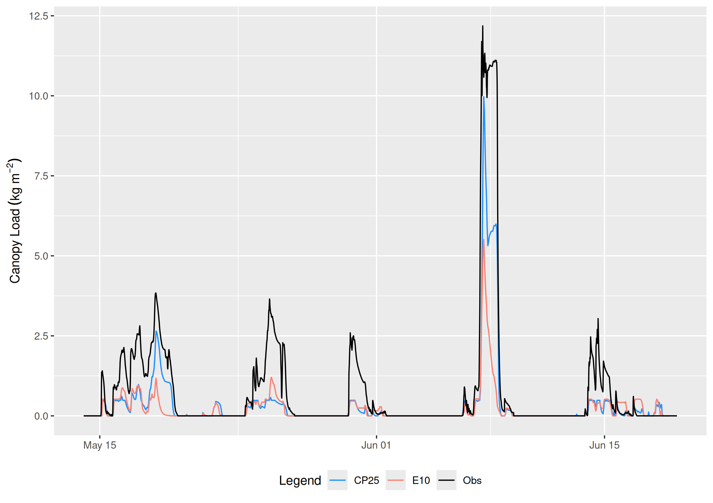

# - Appendix for Chapter 5 {#sec-appdx-ch5}

## Description of New Modules added to the Cold Regions Hydrological Modelling Platform (CRHM)

The following describes the new modules added to the CRHM software as part of this research. The new modules are fully implemented in the CRHM repository \href{https://github.com/acebulsk/crhmcode/blob/alex-ceb-thesis-changes}{\color{blue}{here}} and specific changes are documented in pull request \href{https://github.com/srlabUsask/crhmcode/pull/471}{\color{blue}{\#471}}.

### Initial Snow Interception

**Description:**

A new module called `CanopyVectorBased` was added to CRHM to compute initial snow interception in the canopy as described in Chapter 3. This module differs from the existing CRHM `CanopyClearingGap` module based on @Ellis2010 which calculated initial interception as a function of antecedent canopy snow load and canopy density. The new module represents an improvement by calculating initial interception as a function of snowfall and canopy density (function of canopy coverage and hydrometeor trajectory angle) based on observations presented in Chapter 3. The association of interception with canopy snow load is now handled only once by the canopy snow unloading routine in the canopy snow ablation module.

**Module Code:**

- https://github.com/acebulsk/crhmcode/blob/alex-ceb-thesis-changes/crhmcode/src/modules/ClassCRHMCanopyVectorBased.cpp
- https://github.com/acebulsk/crhmcode/blob/alex-ceb-thesis-changes/crhmcode/src/modules/ClassCRHMCanopyVectorBased.h

### Canopy Snow Energy and Mass Balance

**Description:**

A new module called `CanopySnowBalance` simulates the physically-based energy and mass balance of snow stored in forest canopies following developments from Chapter 4.  It is designed to be paired with the `CanopyVectorBased` module and together with `CanopySnowBalance` replaces the `CanopyClearingGap` module in CRHM. The `CanopySnowBalance` represents both dry- and melt-induced canopy snow unloading coupled with energy balance-based melt and sublimation calculations. 

**Module Code:**

- https://github.com/acebulsk/crhmcode/blob/alex-ceb-thesis-changes/crhmcode/src/modules/ClassCanopySnowBalanceCRHM.cpp
- https://github.com/acebulsk/crhmcode/blob/alex-ceb-thesis-changes/crhmcode/src/modules/ClassCanopySnowBalanceCRHM.h
- https://github.com/acebulsk/crhmcode/blob/alex-ceb-thesis-changes/crhmcode/src/modules/ClassCanopySnowBalanceBase.cpp
- https://github.com/acebulsk/crhmcode/blob/alex-ceb-thesis-changes/crhmcode/src/modules/ClassCanopySnowBalanceBase.h

## Canopy Snow Load Evaluation

@fig-swe-ann-peak shows a subset of Figure 5 from the main manuscript to better illustrate select spring snow events with mixed snow/rain.

{#fig-swe-ann-peak}