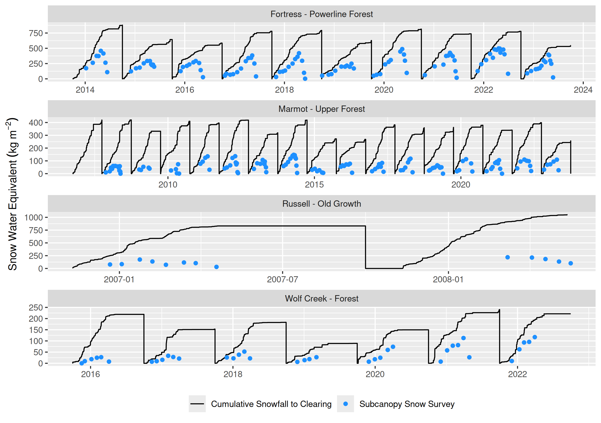
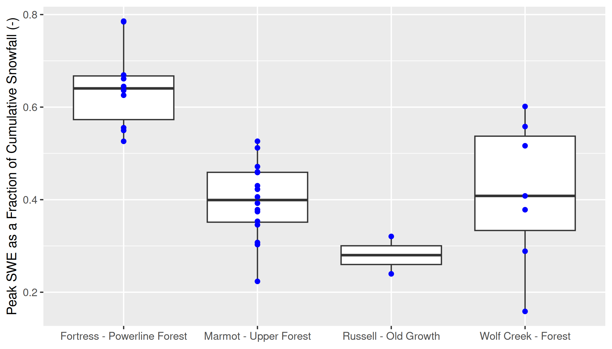
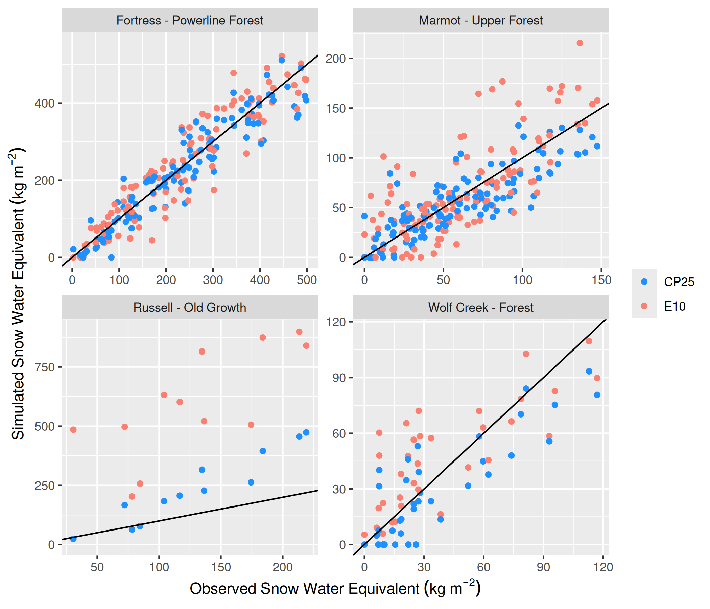

## Canopy Snow Load Evaluation

@fig-swe-ann-peak shows a subset of Figure 5 from the main manuscript to better illustrate select spring snow events with mixed snow/rain.

{#fig-swe-ann-peak}

## Subcanopy Snowpack Evaluation

@fig-swe-ann-mean and @fig-swe-ann-peak show the annual mean and max of simulated and observed snow water equivalent. @fig-scatter shows a scatterplot of simulated vs. observed snow water equivalent over all years by each site. 

{#fig-swe-ann-mean}

{#fig-swe-ann-peak}

{#fig-scatter}

